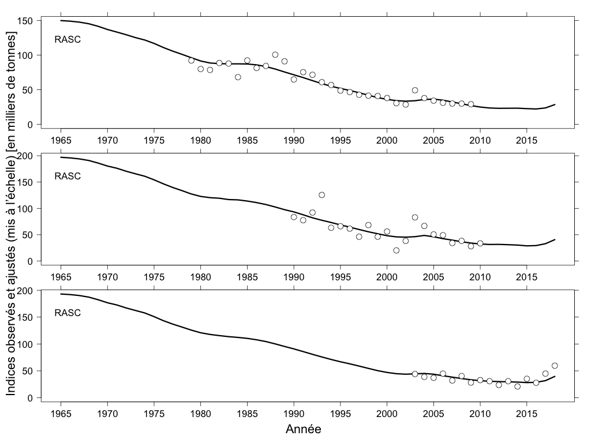
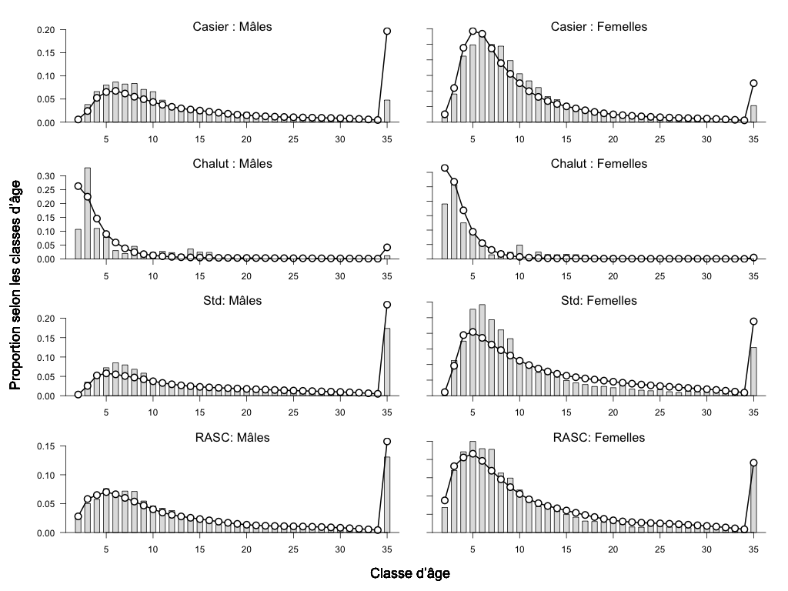

# Les figures

```{r, echo = FALSE, warning = FALSE, include = FALSE}

ageFitsCap <- "Modèle d’exploitation de la moyenne ajusté en fonction des observations sur l’âge, de haut en bas, pour la pêche commerciale au casier (Casier), la pêche commerciale au chalut (Chalut), le relevé normalisé (Std) et le relevé aléatoire stratifié (RASC). Les barres grises représentent la proportion moyenne des observations selon l’âge, et les points reliés par une ligne montrent la répartition moyenne prévue des observations selon l’âge dans le modèle d’exploitation. Les moyennes sont établies au fil des ans à partir d’observations."

jointPostCap <- "Échantillons par simulation MCCM de répartition conjointe et marginale a posteori (points gris) concernant l’inclinaison de la pente de la relation stock-recrutement ($h$; axe $x$) et la biomasse du stock reproducteur en 2018 ($B_{2018}$; axe $y$). Les lignes pointillées indiquent la médiane, les 10e et 90e centiles de chaque répartition marginale, alors que les centiles de la répartition de la biomasse du stock reproducteur sont rajustés pour correspondre à la droite de régression entre les deux répartitions marginales. Les points de couleur avec des bordures noires aux intersections de certains centiles sont les centres d’échantillonnage pour les cinq scénarios du modèle d’exploitation relatif à la productivité et à la biomasse, avec des étiquettes correspondant aux colonnes du tableau 1. Les échantillons par simulation MCCM a posteori en couleur montrent l’ensemble de tous les points à une distance de Mahalanobis de 0,6 du centre de la même couleur."

```

```{r, echo = FALSE, warning = FALSE, out.width = "90%", fig.align = "center", fig.cap=jointPostCap, echo = FALSE}


sampleCols <- RColorBrewer::brewer.pal(n = 5, "Dark2")

plot( x = var2Mat[,1], y = var2Mat[,2],
      xlab = "Inclinaison de la pente de la relation stock-recrutement",
      ylab = "Biomasse du stock reproducteur en 2018 (kt)",
      pch = 16, col = "grey75" )
  for(pIdx in 1:length(pairs) )
  {
    points( x = subDists[[pIdx]][,1], 
            y = subDists[[pIdx]][,2], 
            col = alpha(sampleCols[pIdx],
            alpha = (1.1 * sampDist - subDists[[pIdx]][,4])/(1.1*sampDist)),
            pch = 16)
  }
  legend( x = "topleft", bty = "n",
          legend = names(pairs),
          pch = 16, col = sampleCols )
  abline (a=coef(v1v2)[1],b=coef(v1v2)[2],col="black",lty=2,lwd=3)
  abline (  a=coef(v1v2)[1] + var2quants[1] - mean2d[2],
            b=coef(v1v2)[2],col="black",lty=2,lwd=3)
  abline (  a=coef(v1v2)[1] + var2quants[2] - mean2d[2],
            b=coef(v1v2)[2],col="black",lty=2,lwd=3)
  abline (v = var1quants, lty =3, col = "black", lwd =3)
  abline (v = mean2d[1],  lty =3, col = "black", lwd =3)
  
  for( pIdx in 1:length(pairs))
    points( x=pairs[[pIdx]][1],y=pairs[[pIdx]][2], 
            pch=21, bg = sampleCols[pIdx], lwd = 2, cex = 2 )

```


```{r, echo = FALSE, warning = FALSE, include = FALSE}
idxFitsCap <- "Ajustements du modèle d’exploitation par rapport aux indices de capture par unité d’effort (CPUE) [kg/casier] de la pêche commerciale au casier (Casier, haut), du relevé normalisé sur la morue charbonnière (Std, milieu) et du relevé aléatoire stratifié de la morue charbonnière (RASC, bas). Les points illustrent les observations dimensionnées selon la capturabilité, et les lignes montrent la biomasse vulnérable du modèle d’exploitation."

```


```{r, warning = FALSE, out.width = "90%", fig.align = "center", fig.cap=idxFitsCap, echo = FALSE}

```

\newpage

```{r, warning = FALSE, out.width = "90%", fig.align = "center", fig.cap=ageFitsCap, echo = FALSE}

```

\newpage


\newpage

\blandscape
```{r, echo = FALSE, include = FALSE, warning = FALSE}
hiRecSimRepCap <- "Reproduction unique d’une simulation tirée des \\textbf{modèles d’exploitation de référence} avec une classe de 2015 à estimation élevée. La première rangée de panneaux montre la biomasse du stock reproducteur (ligne rouge), la biomasse légale (ligne pointillée noire) et la biomasse estimée du modèle de production excédentaire (lignes vertes et grises) lorsqu’elle est estimée dans le cadre de la procédure de gestion. La rangée du milieu illustre les taux de la récolte légale (ligne pleine noire) et de la récolte d’individus de taille inférieure (ligne pointillée bleue), tandis que la rangée du bas montre les recrutements selon le modèle d’exploitation (ligne noire avec points orange). Les premier et deuxième ajustements s’appliquent aux première et deuxième années d’application de la procédure de gestion."

simRecSimRepCap <- "Reproduction unique d’une simulation tirée des \\textbf{modèles d’exploitation de robustesse} avec une classe de 2015 simulée de manière stochastique. La première rangée de panneaux montre la biomasse du stock reproducteur (ligne rouge), la biomasse légale (ligne pointillée noire) et la biomasse estimée du modèle de production excédentaire (lignes vertes et grises) lorsqu’elle est estimée dans le cadre de la procédure de gestion. La rangée du milieu illustre les taux de la récolte légale (ligne pleine noire) et de la récolte d’individus de taille inférieure (ligne pointillée bleue), tandis que la rangée du bas montre les recrutements selon le modèle d’exploitation (ligne noire avec points orange). Les premier et deuxième ajustements s’appliquent aux première et deuxième années d’application de la procédure de gestion."
```

```{r, echo = FALSE, warning = FALSE, out.width = "90%", fig.align = "center", fig.cap=hiRecSimRepCap}
knitr::include_graphics("data/BtFitUtRt/hiRec2016_wtd/hstAl_am5/BtFitUtRt_rep13.pdf")
```

\newpage

```{r, echo = FALSE, include = FALSE, warning = FALSE}
hiRecSimEnvCap <- "Enveloppes de simulation combinées et pondérées provenant des cinq modèles d’exploitation relatifs à la productivité et à la biomasse du \\textbf{scénario de recrutement de référence} montrant la procédure de gestion actuelle (Aucun plafond), trois procédures de gestion illustrant la réglementation sur la remise à l’eau, et la procédure de gestion des stocks non exploités (Population non exploitée). La rangée du haut montre la biomasse projetée par rapport à la population non exploitée, la deuxième rangée illustre les prises débarquées, et celle du bas fournit le taux de récolte légale. Dans chaque panneau, les projections médianes sont représentées par des lignes noires épaisses, le centile central (90 \\%) de l’enveloppe est ombré en gris, et les trois reproductions des simulations illustrées correspondent à de minces lignes noires."

simRecSimEnvCap <- "Enveloppes de simulation combinées et pondérées provenant des cinq modèles d’exploitation relatifs à la productivité et à la biomasse du \\textbf{scénario de recrutement de robustesse} montrant la procédure de gestion actuelle (Aucun plafond), trois procédures de gestion illustrant la réglementation sur la remise à l’eau, et la procédure de gestion des stocks non exploités (Population non exploitée). La rangée du haut montre la biomasse projetée par rapport à la population non exploitée, la deuxième rangée illustre les prises débarquées, et celle du bas fournit le taux de récolte légale. Dans chaque panneau, les projections médianes sont représentées par des lignes noires épaisses, le centile central (90 \\%) de l’enveloppe est ombré en gris, et les trois reproductions des simulations illustrées correspondent à de minces lignes noires."
```

```{r, echo = FALSE, warning = FALSE, out.width = "90%", fig.align = "center", fig.cap=hiRecSimEnvCap}
knitr::include_graphics("data/tulipPlots/hiRec2016_wtd/depCatchHR/hiRec2016_wtd_depCatchHR_hstAl_am5.pdf")
```

\newpage

```{r, echo = FALSE, warning = FALSE, out.width = "90%", fig.align = "center", fig.cap=simRecSimRepCap}
knitr::include_graphics("data/BtFitUtRt/simRec2016_wtd/hstAl_am5/BtFitUtRt_rep13.pdf")
```


\newpage

```{r, echo = FALSE, warning = FALSE, out.width = "90%", fig.align = "center", fig.cap=simRecSimEnvCap}
knitr::include_graphics("data/tulipPlots/simRec2016_wtd/depCatchHR/simRec2016_wtd_depCatchHR_hstAl_am5.pdf")
```

\elandscape


