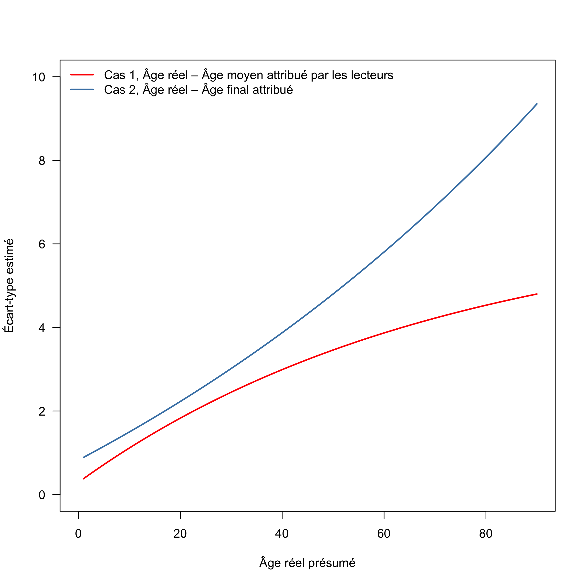
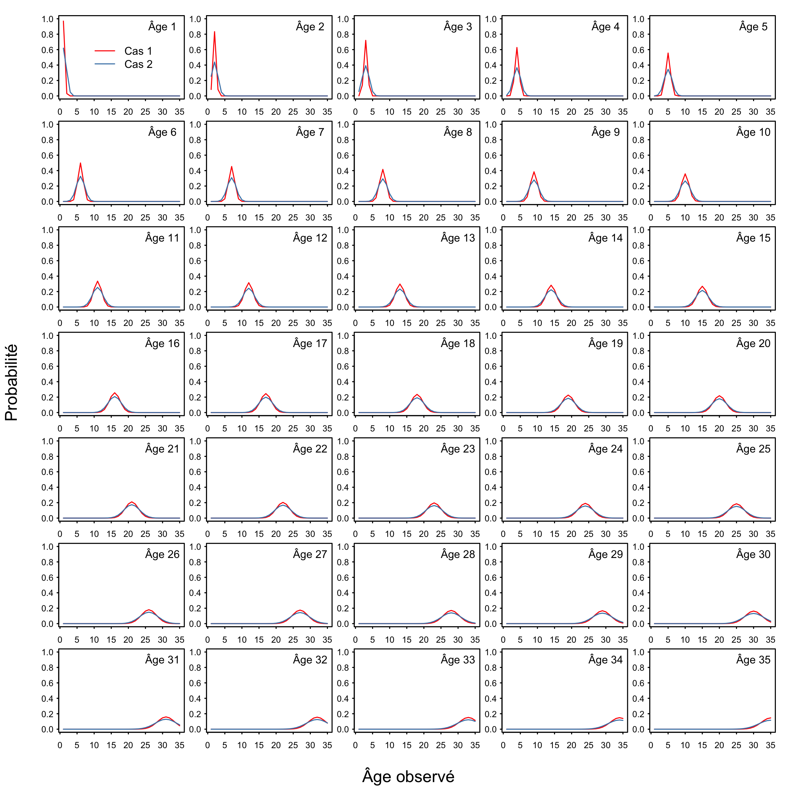
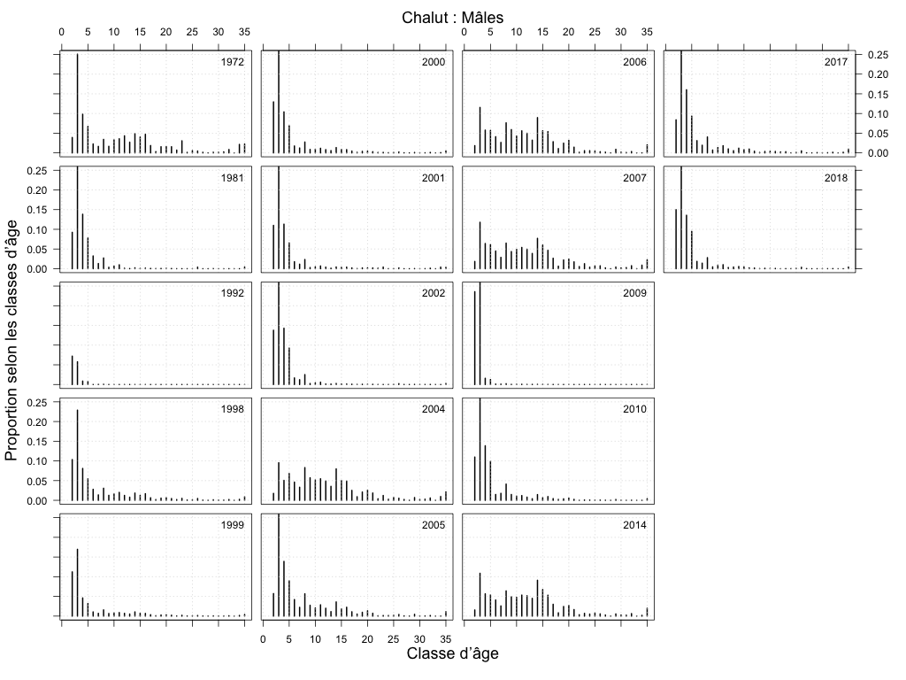
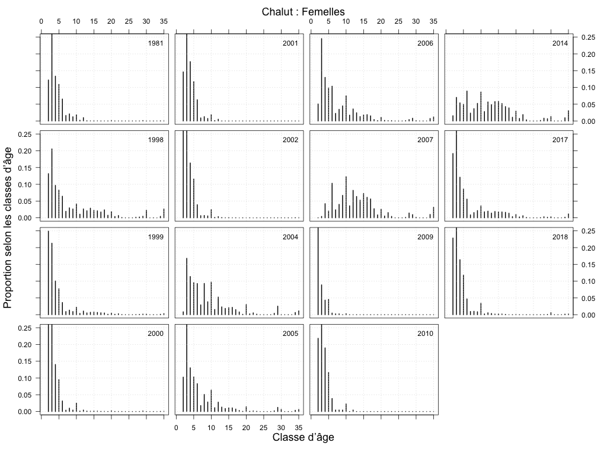

# Annexe \label{sec:app-minor}

## Mise à jour de la matrice des erreurs de détermination de l’âge

Le modèle d’évaluation fondé sur l’âge de la morue charbonnière utilise les données relatives aux prises selon l’âge pour estimer la véritable composition de la population en fonction de l’âge; toutefois, les données observées à ce titre proviennent de lectures d’otolithes qui sont mal connues. Le fait de ne pas tenir compte des erreurs dans les lectures d’otolithes peut entraîner des estimations lissées des classes d’âge et ainsi rendre plus difficile la détection des grandes années de recrutement ou des relations stock-recrutement [@hanselman2012statistical]. Les erreurs de détermination de l’âge peuvent également fausser les estimations des paramètres de croissance, les calendriers de maturation et les taux de mortalité naturelle et mener en conséquence à la surpêche ou à des projections inexactes du rendement [@lai1987effects; @tyler1989implications].

Pour tenir compte des erreurs liées à l’âge, le modèle d’exploitation structuré selon l’âge de la morue charbonnière utilise une matrice des erreurs de détermination de l’âge. Aux fins du présent cycle d’évaluation des stratégies de gestion, nous avons simplifié la formule de la matrice des erreurs de détermination de l’âge en remplaçant le modèle à double géométrie appliqué précédemment par une répartition discrétisée normale. Les deux principales différences entre ces deux formules sont les suivantes : i) la structure d’erreur est limitée de manière à assurer la symétrie avec la formule normale, tandis que le modèle à double géométrie permet une certaine asymétrie dans la répartition des erreurs; et ii) la formule normale tient pour acquis que l’âge réel assigné est le mode de la densité normale, de sorte que les erreurs d’âge ne sont en moyenne pas biaisées.

Pour constituer notre matrice d’erreurs de détermination de l’âge, nous avons utilisé des otolithes qui avaient été lus par deux lecteurs différents au laboratoire de scalimétrie de la Station biologique du Pacifique du MPO. Ces données représentent environ 15\ % des lectures d’otolithes totales pour la morue charbonnière de la Colombie-Britannique; elles sont lues d’abord par le lecteur principal, puis par un lecteur secondaire qui assure le contrôle de la qualité. Dans la majorité des cas, les lecteurs étaient d’accord (62\ %). Dans les cas où ils différaient d’opinion (38\ %), ils se sont consultés pour résoudre l’écart et se sont entendus sur l’âge final attribué (comm. pers., J. Groot, MPO). Dans la plupart des cas, la lecture finale selon l’âge était celle attribuée par le lecteur secondaire ou primaire (36\ %), mais dans quelques cas, un nouvel âge a été retenu (2\ %).

Nous avons appliqué des modèles statistiques pour estimer la probabilité d’observation d’une classe d’âge a) compte tenu de l’âge réel b) selon les méthodes décrites dans @richards1992statistical et @heifetz1999age. Le modèle suppose une répartition normale des erreurs de détermination de l’âge où l’écart-type estimé de l’âge observé pour un véritable âge b est fondé sur trois paramètres $\Phi = \{ \sigma_1, \sigma_A, \alpha \}$ de la manière suivante :

\begin{equation}
\sigma(b) = \left\{
 \begin{array}{ll}
  \sigma_1 + (\sigma_A – \sigma_1) \frac{1 – e^{-\alpha(b – 1)} }{1 – e^{-\alpha(A – 1)}}, & \alpha \neq 0; \\
  \sigma_1 + (\sigma_A – \sigma_1) \frac{b-1}{A-1}, & \alpha = 0.\\
 \end{array} \right.
\end{equation}

Les paramètres $\sigma_1$ et $\sigma_A$ sont les écarts-types pour $b=1$ et $b=A$, qui représentent respectivement les âges minimal et maximal. Le paramètre $\alpha$ détermine la non-linéarité de la fonction, de sorte que $\sigma(b)$ devient linéaire comme $\alpha \rightarrow 0$. La matrice des erreurs de détermination de l’âge est définie comme suit :

\begin{align}
q(a ~|~ b, \Phi) &= \frac{x_{ab}(\Phi)}{\sum_{a = 1}^A x_{ab}(\Phi) }; \\x_{ab} &= \frac{1}{\sqrt{2\pi}\sigma(b)} e^{-\frac12 \left[ \frac{a-b}{\sigma(b)} \right]^2}.
\end{align}

Étant donné que l’âge réel des poissons est inconnu, il est impossible de déterminer avec précision le biais dans les lectures d’âge et d’établir si certaines classes d’âge sont plus susceptibles d’être sous-estimées ou surestimées. Nous avons essayé deux approches différentes pour déterminer l’« âge réel » présumé, soit 1) la moyenne des âges attribuées par les deux lecteurs arrondie au nombre entier le plus proche [@heifetz1999age], et 2) l’âge final attribué. Pour les deux approches, nous établissons $A=90$ en fonction de l’âge maximal attribué par les lecteurs.

La probabilité $\mathcal{L}$ des âges $A$ observés compte tenu des âges réels B est alors définie comme suit :

\begin{equation}
\mathcal{L}(A|B) = \prod_{i = 1}^I \prod_{j = 1}^J q(a_{ij} ~|~ b_i \Phi),\end{equation}

où $b_i$ est l’« âge réel » présumé du poisson $i$, et $a_{ij}$ est l’âge attribué par le lecteur $j$ au poisson individuel $i$. Les estimations maximales des paramètres de probabilité, l’écart-type prévu à l’âge et les matrices d’erreurs de détermination de l’âge sont fournies ci-dessous (tableau A1, figures A1 et A2).


## Clé âge-longueur pour chalut et courbe de sélectivité mise à jour

Le modèle d’exploitation structuré en fonction de l’âge de la morue charbonnière utilise des observations sur des prises selon l’âge provenant de la pêche commerciale pour estimer les fonctions de mortalité naturelle et de sélectivité des engins. La sélectivité des chaluts constitue un déterminant clé de la diminution des estimations inexactes relatives aux prises et remises à l’eau de morues charbonnières de taille inférieure à la taille réglementaire [@cox2019evaluating]. Jusqu’à maintenant, le modèle de sélectivité des chaluts dépendait fortement des valeurs antérieures pour une courbe de sélectivité estimée à partir du rétablissement de poissons étiquetés (dans l’année suivant leur remise à l’eau) dans le cadre de la pêche commerciale par chalut. Pour améliorer les estimations de la mortalité des poissons de taille réglementaire et de ceux de taille inférieure à la taille réglementaire dans le secteur du chalutage, nous avons utilisé les données sur les prises selon l’âge et les prises selon la longueur provenant du secteur du chalutage en Colombie-Britannique pour établir une clé âge longueur selon le sexe, qui a ensuite servi à élargir la taille de l’échantillon de prises selon l’âge.

Pour définir notre clé âge-longueur, nous avons utilisé toutes les données disponibles sur les prises selon l’âge recueillies lors des sorties observées dans le cadre de la pêche commerciale au chalut. Ces données ont ensuite servi à alimenter la matrice empirique des fréquences selon l’âge, en plaçant les poissons dans des casiers de 3 cm de longueur et dans des classes d’âge d’un an. Nous avons établi cette matrice comme suit :
\begin{equation}
F = \left[ n_{l,a} \right],
\end{equation}
où $n_{l,a}$ est le nombre de poissons observés dans le casier de longueur $l$ et la classe d’âge $a$. La matrice $A$ a été convertie en une matrice de probabilité $P$ selon l’âge et la longueur $l$ $ au moyen de la normalisation des colonnes de $A$.
\begin{equation}
P_{l,a} = F_{l,a} / \sum_{a'} F_{l,a'}
\end{equation}

Nous avons ensuite produit des données sur la composition en fonction de l’âge prévue en appliquant la matrice $P$ aux compositions selon la longueur $C_l$ dérivées des données sur les prises selon la longueur du chalutage commercial.
\begin{align}
C_a &= P^T \cdot C_l,
\end{align}
où $P$ est transposé de façon à ce que la dimension relative à la longueur corresponde au vecteur $C_l$. Nous avons inclus dans $C_l$ seulement les données sur les prises selon la longueur des années où au moins cinq sorties ont été échantillonnées. Nous avons défini les clés $P_m$ et $P_f$ pour les poissons mâles et femelles, respectivement, et généré des observations selon l’âge pour chaque sexe (figures A3 et A4). Aux fins des observations sur la longueur, les poissons de sexe indéterminé ont été traités comme des spécimens mâles, puisque l’optimisation du modèle d’exploitation ne convergerait pas s’ils étaient considérés comme des poissons femelles.

Les compositions déduites des prises selon l’âge ont eu un effet notable sur les courbes de sélectivité en fonction de la longueur pour la flottille de chalutage (figure A5). La classe de taille avec une pleine sélectivité est passée d’environ 42 cm à 48 cm, et la forme du dôme de la courbe de sélection Gamma était plus étroite, ce qui a entraîné une désélection d’environ 60 % des poissons en raison de la limite de taille de 55 cm, comparativement à environ 80 % pour le modèle normal en 2016.


\newpage


```{r, echo = FALSE, include = FALSE, warning = FALSE}
ageErrTable <- tibble::tribble( 
    ~Case,   ~TrueAge,           ~sigma1, ~sigmaA, ~alpha, 
    1,      "Âge moyen attribué par les lecteurs",    0.38,    4.80,    0.014,
    2,      "Âge final attribué", 0.89,    9.35,    -0.008 )

colnames(ageErrTable) <- c( "Cas",
                            "Âge réel",
                            "$\\sigma_1$",
                            "$\\sigma_A$",
                            "$\\alpha$" )
```

```{r, echo = FALSE, warning = FALSE, results = "as-is"}
csasdown::csas_table(  ageErrTable,
                       caption = "Paramètres du modèle d’erreur de détermination de l’âge pour les deux cas d’âge réel testés.",
                       booktabs = TRUE, escape = FALSE,
                       font_size = 12 ) %>%
    kable_styling(  latex_options = c("hold_position"),
                    bootstrap_options = c("striped", "hover","scale_down")     )
```

\newpage

```{r, echo = FALSE, warning = FALSE, include = FALSE}

ageErr1Cap <- "Estimation de l’écart-type des âges observés pour les deux cas d’attribution de l’âge examinés."
ageErr2Cap <- "Probabilité des âges observés compte tenu de l’âge réel indiqué dans le coin supérieur droit de chaque panneau pour les deux cas d’attribution de l’âge examinés"


maleAgeCap <- "Compositions estimées des prises mâles selon l’âge qu’a générées la clé âge longueur de la pêche au chalut créée à partir des observations sur la longueur des poissons mâles et de sexe indéterminé."
femaleAgeCap <- "CCompositions estimées des prises femelles selon l’âge qu’a générées la clé âge-longueur de la pêche au chalut créée à partir des observations sur la longueur des poissons femelles."


trawlSelCap <- "Courbes de sélectivité selon la longueur pour la pêche au chalut des modèles d’exploitation de 2016 (ligne grise pointillée) et de 2019 (ligne noire pleine) et limite de taille légale (ligne pointillée rouge verticale) L’axe de longueur commence à la longueur modélisée à l’âge 1 et 32 cm."
```


```{r, warning = FALSE, out.width = "90%", fig.align = "center", fig.cap=ageErr1Cap, echo = FALSE}

```

\newpage

```{r, warning = FALSE, out.width = "90%", fig.align = "center", fig.cap=ageErr2Cap, echo = FALSE}

```

\newpage

```{r, warning = FALSE, out.width = "90%", fig.align = "center", fig.cap=maleAgeCap, echo = FALSE}

```

\newpage

```{r, warning = FALSE, out.width = "90%", fig.align = "center", fig.cap=femaleAgeCap, echo = FALSE}

```

\newpage

```{r, warning = FALSE, out.width = "90%", fig.align = "center", fig.cap=trawlSelCap, echo = FALSE}
knitr::include_graphics("data/trawlSelOverlay.pdf")
```


