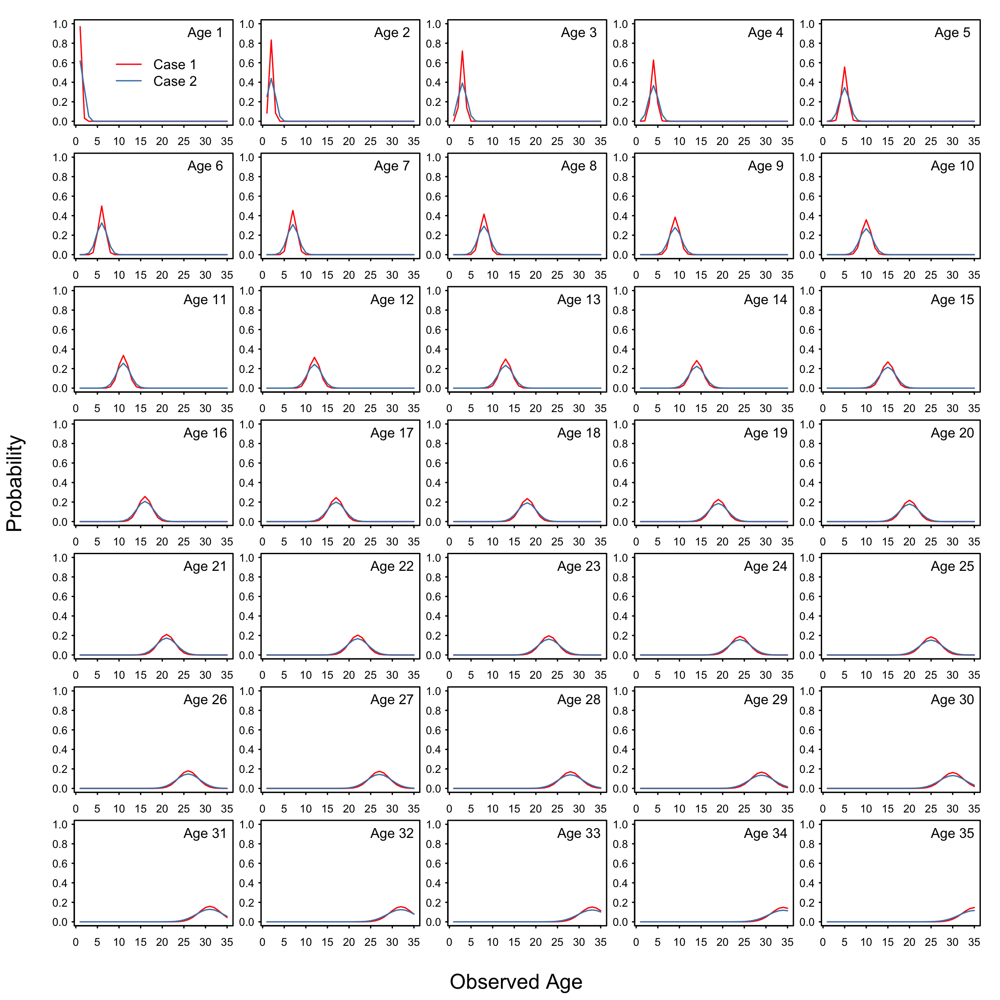

```{r setup, echo=FALSE, cache=FALSE, message=FALSE, results='hide', warning=FALSE}
library(knitr)
if (is_latex_output()) {
  knitr_figs_dir <- "knitr-figs-pdf"
  knitr_cache_dir <- "knitr-cache-pdf"
  fig_out_type <- "png"
  kable_format <- "latex"
} else {
  knitr_figs_dir <- "knitr-figs-docx"
  knitr_cache_dir <- "knitr-cache-docx"
  fig_out_type <- "png"
  kable_format <- "pandoc"
}
fig_asp <- 0.618
fig_width <- 9
fig_out_width <- "6in"
fig_dpi <- 180
fig_align <- "center"
fig_pos <- "htb"
opts_chunk$set(
  collapse = TRUE,
  warning = FALSE,
  message = FALSE,
  comment = "#>",
  fig.path = knitr_figs_dir,
  cache.path = knitr_cache_dir,
  fig.asp = fig_asp,
  fig.width = fig_width,
  out.width = fig_out_width,
  echo = FALSE,
  #  autodep = TRUE,
  #  cache = TRUE,
  cache.comments = FALSE,
  dev = fig_out_type,
  dpi = fig_dpi,
  fig.align = fig_align,
  fig.pos = fig_pos
)
options(xtable.comment = FALSE)
options(kableExtra.latex.load_packages = FALSE)
options(knitr.kable.NA = '')
```

```{r load-libraries, cache=FALSE}
# add other packages here:
library(csasdown)
library(kableExtra)
library(tidyverse)
library(coda)
library(MASS)
library(chemometrics)
library(mvtnorm)
```

```{r, echo = FALSE, warning = FALSE}
# Try a sampling system for h and SSB using
# Mahalnobis distance.
.mahalanobisDist <- function( centres = NULL,
                              post = mcmc, 
                              pars = c("h","spawnB54"),
                              qProb = c("mean","mean"),
                              mDist = .3,
                              seed = NULL )
{
  if( !is.null(seed) )
    set.seed(seed)

  # Reduce to the joint marginal we're interested in
  subDist <- post[, pars ]

  covMtx <- cov(subDist)

  # Calc centre points for Mahalanobis calc if
  # not explicitly  supplied
  if(is.null(centres))
    centres <- getCentre( subDist, pars, qProb )

  # Now we loop over the distribution
  # and calculate the dissimilarity bn
  # the centre and each post point
  subDist <-  subDist %>%
              mutate( rIdx = 1:nrow(subDist),
                      mhnDist = NA )


  for( rIdx in 1:nrow(subDist) )
  {
    postPoint <- as.matrix(subDist[rIdx,pars],nrow = 1)
    diff      <- postPoint - as.numeric(centres)

    subDist[rIdx,"mhnDist"] <-  mahalanobis(  x = postPoint, 
                                              center = centres,
                                              cov = covMtx )
  }

  # Now reduce to points within mDist and randomly
  # sample them
  subDist <- subDist %>% filter( mhnDist < mDist )

  # return
  subDist
} # END .mahalanobisSample()


summPostMeanSD <- function( x, se = FALSE )
{

  meanX <- signif(mean(x),3)
  sdX   <- signif(sd(x),2)

  if( se )
    out <-  paste( meanX, " (", sdX,")", sep = "")

  else out <- paste(meanX)

  out
}

```

<!--chapter:end:index.Rmd-->

# Context

Since 2008, Fisheries and Oceans Canada (DFO) and the British Columbia 
(BC) groundfish fishing industry have collaborated on a management 
strategy evaluation (MSE) process intended to maintain a transparent 
and sustainable harvest strategy for Sablefish fisheries in BC. 
Transparency and potential sustainability of candidate management 
procedures (MPs) are demonstrated by simulating MP performance 
against a set of pre-agreed biological and fishery objectives (hereafter referred to as Fishery Objectives). Operating models underlying the simulations are intended to represent 
key uncertainties related to Sablefish stock status and productivity. 
The Sablefish MSE process has been reviewed in several Canadian 
Science Advisory Secretariat (CSAS) peer-review processes, and independent peer-reviewed 
scientific literature [@cox2008practical;
@cox2011management; @cox2013roles; @cox2019evaluating; 
@dfo2014performanc]. Canadian Sablefish harvest advice derived
from simulation-tested MPs has been adopted by DFO every year since 2011.

The Sablefish MSE aims to follow a 3-year cycle in which the 
operating model (OM) is re-fitted to updated fishery and survey 
biomass indices, catch-at-age, at-sea releases, and tag 
release-recoveries. Each 3-year update also offers an opportunity 
to revise the Fishery Objectives, as well as to 
propose new candidate MPs. 

Previous BC Sablefish assessments and MSE work have demonstrated that 
low recruitment (on average) over the past three decades has 
contributed to a long-term decline in spawning stock biomass 
and harvest opportunities. Stakeholder and management 
consultations identified at-sea release mortality of 
sub-legal Sablefish (i.e., fish smaller than 55 cm size limit) 
as a potential source of mortality that, if reduced or avoided, 
may improve production of over-55 cm Sablefish, spawning stock 
biomass, and, ultimately, future harvest opportunities 
[@cox2019evaluating]. While some voluntary tactics 
aimed at reducing sub-legal mortality have been identified 
(e.g., improved fleet communication, and increased electronic monitoring), management 
measured aimed at reducing sub-legal mortality have not been 
formally evaluated through the Sablefish MSE process. However, 
past closed-loop simulations suggest that both full avoidance and 
full retention of sub-legal Sablefish may improve both average 
annual Sablefish yield in directed fisheries as well as the 
probability of stock rebuilding to $B_{MSY}$ [@cox2011management; 
@cox2019evaluating]. Unfortunately, full avoidance may not 
be feasible, especially in trawl fisheries, which encounter 
sub-legal Sablefish as part of fishing operations for other 
species, while full retention may involve lost fishing 
opportunities (particularly for the trawl sector) and 
lower profitability for directed fisheries, because sub-legal 
Sablefish are worth less per-kilogram than legal-sized fish. 
In consultations, industry stakeholders suggested that 
a potential solution would involve incentives that shift fishing 
behaviour toward higher avoidance of sub-legal Sablefish.

The DFO Fisheries Management Branch has, therefore, requested that 
the Science Branch (i) update the Sablefish OM to 
include the most recent data available (up to 2018); (ii) update 
advice about expected performance of the current MP; and 
(iii) evaluate alternative MP and/or management measures aimed at 
reducing productivity losses to sub-legal mortality. The key issue 
in (iii) is identifying MPs that minimize the impact of such measures 
on fishing opportunities in non-directed fisheries (i.e., trawl) 
where sub-legal Sablefish are captured incidentally.

Advice arising from this CSAS Science 
Response will be used to select a new MP for BC Sablefish for years 
2020-2022 that is compliant with the DFO Sustainable Fisheries Framework 
and A Fishery Decision-making Framework Incorporating the Precautionary 
Approach policy [@DFO2009]. In addition, this Science Response informs 
fishery managers and stakeholders about the fishery implications of limiting 
productivity losses due to sub-legal Sablefish releases at-sea. 

This Science Response Report results from the Science Response Process of 
September 2019 on evaluating the robustness of candidate management procedures 
in the BC Sablefish (*Anoplopoma fibria*) fishery for 2019-2020.

<!--chapter:end:01_context.Rmd-->


<!--chapter:end:02_background.Rmd-->

# Analysis and response

This Science Response uses a closed-loop simulation approach to evaluate the 
relative performance of candidate MPs for the BC Sablefish fishery,
using identical methodology to that presented in the previous
MSE cycle [@cox2019evaluating]. The following sub-sections provide 
brief descriptions of the updated data used to condition the 
Sablefish OM, the changes required to fit that data, and 
the new MP elements that were tested. Additional 
details of the simulation procedures, diagnostic checks, and 
performance measure calculations are given in @cox2019evaluating.


In this Science Response we specifically:

1.    Describe OM fits and inferences after fitting 
(conditioning) to updated biomass indices, catch-at-age, and new 
catch-at-age data derived from length-composition sampling of 
Sablefish in the trawl fishery; 
2.    Derive a grid of five reference OMs and five 
robustness trial OMs based on uncertainties about 
Sablefish stock status and productivity (reference OMs) and 
year 2015 recruitment (robustness OMs); and
3.    Simulate and rank candidate MPs under the reference and
robustness OMs based on performance against Fishery Objectives
(see below).


## Methods

### Updates to the OM

Data updated to 2018 included biomass indices and catch-at-age 
for the stratifed random trap survey (StRS), catch-at-age for 
the commercial longline trap fishery, catch and total at-sea 
releases (in biomass units) for the commercial longline trap, 
longline hook, and trawl fisheries. We also obtained new 
catch-at-age and catch-at-length datasets for the trawl fishery 
to help estimate trawl selectivity, which is the key 
determinant of sub-legal Sablefish catch in trawl fisheries. 
The full trawl catch-at-age dataset (with some missing years) 
was derived from an age-length key given age and length data 
from 1972 to 2017.

A number of small changes were made to the OM as 
part of routine attempts to improve fits to various data. These 
included (i) changing the functional form of trawl selectivity 
to a gamma density function (Figure A5), (ii) reducing the youngest modelled 
age class from age-3 to age-2 for all age composition series 
to better reflect the range of age-composition observations, 
(iii) adding new commercial trawl age-composition data (Appendix 
A), (iv) adding an estimated recruitment deviation in 
2015, rather than using the expected recruitment off the 
stock-recruit curve, (v) updating the ageing-error matrix to use 
a simpler normal approximation recommended in the previous CSAS
review [@cox2019evaluating]; and (vi) imposing a standard deviation 
of $\sigma = 0.1$ (on the log-scale) on trawl at-sea release 
observation errors to force a better fit to those data. Previous 
models avoided estimating recruitment in the three most recent years,
mainly because this would have been the first age-at-entry 
observations provided to the model and there is typically little 
information to support those estimates because fish are too small to 
be selected by the fisheries or surveys. However, for this update, 
we made change (iv) above (i.e., estimated recruitment deviation in 2015) 
because we needed to improve fits to recent (very 
high) trawl at-sea release observations. Otherwise, we would be 
simulating effects of at-sea releases based on a model that could not 
adequately fit historical at-sea releases. This change has a 
potentially large impact on simulated MP performance and, therefore, 
is a focus of the robustness OMs (described below).


### Operating model scenarios

#### Reference OMs

The reference OMs were derived using the same method as the previous 
MSE cycle [@cox2019evaluating]. Briefly, we derived five OMs defined by the 
joint posterior distribution of 2018 spawning stock biomass (to reflect 
short-term biological risk) and stock-recruitment steepness (to reflect 
long-term stock productivity risk). The five combinations were chosen to 
represent the joint marginal mean of 2018 biomass and steepness and four 
outer points lying at the intersection of the mean of one variable, 
and the 10th and 90th percentiles of the marginal density of the other 
variable (Figure 1). This set of five OMs was chosen to maintain 
consistency with the previous MSE cycle [@cox2019evaluating]. For each 
of the five posterior points, the operating model was conditioned on a 
sample of 100 posterior draws constrained to lie within a Mahalanobis 
distance of 0.75 units from that point. We then used an empirical 
estimate of the posterior density at each of the five centres as a 
plausibility score for weighting MP performance across the 
five OMs within each of the reference and robustness sets.

#### Robustness OMs

The robustness OMs were identical to the five reference OMs with the exception 
of how the recruitment from the 2015 year class was treated in the OM 
historical conditioning and projections. The reference OM used draws 
from the joint posterior distribution (as defined above) for the 2015 
year class, which is approximately 22 million fish or about 8 times 
the historical average. For the robustness OMs, we simulated recruitment 
based on the stock-recruitment relationship resulting in an
expected 2015 year class that was more similar 
to the long-term average ($\sim 2.63$ million). 

### Fishery Objectives

Objectives for the B.C. Sablefish fishery have been developed 
iteratively over the past decade via consultations between 
fishery managers, scientists, and industry stakeholders 
[@cox2009evaluation; @cox2011management; @dfo2014performanc; 
@cox2019evaluating]. The five primary objectives 
guiding this fishery are:

1.  **P(fSSB > LRP)**: Maintain female spawning stock biomass (fSSB) 
      above the limit reference point $LRP = 0.4B_{MSY}$, where 
      $B_{MSY}$ is the OM female spawning biomass at maximum 
      sustainable yield ($MSY$), in 95% of years measured over two 
      Sablefish generations (36 years);
2.  **P(decline)**: When female spawning stock biomass is between 
      $0.4B_{MSY}$ and $0.8B_{MSY}$, limit the probability of decline over 
      the next 10 years from very low (5%) at $0.4B_{MSY}$ to 
      moderate (50%) at $0.8B_{MSY}$.  At intermediate stock status 
      levels, define the tolerance for decline by linearly 
      interpolating between these probabilities;
3.  **P(fSSB > $B_{MSY}$)**: Maintain the female spawning biomass above 
      a target level of (a) $B_{MSY}$ when inside the healthy zone, 
      or (b) $0.8B_{MSY}$ when rebuilding from the Cautious zone, 
      in the year 2052 with a probability of 50%;
4.  **P(TAC < 1,992 t)**: Minimize probability that annual TAC levels 
      are below 1,992 tonnes measured over two Sablefish 
      generations; and
5.  **MaxCatch**: Maximize the average annual catch over 10 years 
      subject to Objectives 1-4.

Performance measures corresponding to Fishery Objectives 1-4 (in bold) are read as 
"Probability of (condition)". Performance measures are calculated for each 
simulation replicate, and the expected performance for a management procedure 
is summarized by the mean (or median) over the 100 replicates of each simulation. 
Full details of performance measures and calculations are given in 
@cox2019evaluating.

As noted above, there is a price premium for larger size classes of Sablefish, 
which means that the same tonnage of landed catch may yield widely different 
dockside values if the underlying size distributions of individual fish are 
substantially different. This may have consequences for sub-legal management measures
that require landing small Sablefish (e.g., no size limit). Therefore,
in addition to presenting catch performance statistics (e.g., Fishery Objective 5), we 
also computed cumulative revenue over 10 years and average revenue 
per tonne by fleet (because the size composition of the catch also differs by 
fleet).


### Management procedures

A management procedure represents a specific, repeatable algorithm for 
computing annual total allowable catches (TACs) in a fishery. In most cases, 
MPs involve monitoring data, assessment methods for processing data and 
estimating stock status, harvest control rules for translating assessment 
outputs into catch limits, and meta rules that may include constraints on 
TAC changes, as well as conditions (e.g., exceptional circumstances) for 
triggering deviations from the standard MP harvest advice.

The MP currently used to set annual Sablefish TACs was initially developed 
in 2011 and revised in two subsequent MSE iterations. Generally, the 
MP consists of (i) __data__ - landed catch and three biomass indices; 
(ii) __assessment method__ -  a surplus production model with 
observation and process errors for estimating stock biomass from the biomass 
indices and landings; (iii) __harvest control rule__ - a 60:40 harvest control rule 
(HCR) in which the target harvest rate is adjusted from 0% when the estimated biomass 
is below 40% of $B_{MSY}$ to a maximum value when estimated biomass is 
above 60% of estimated $B_{MSY}$; (iv) __a meta rule__ stating that TAC increases are 
0 unless the HCR recommended increase is more than 200 tonnes (TAC decreases 
are always adopted); and (v) __a meta rule__ adjusting the maximum target 
fishing mortality rate from 9.5% in 2017 to 5.5% in 2021. Total
TACs are allocated among the three sectors according to
40.37% for longline trap, 50.90% for longline hook, and 8.75%
for trawl, with the remaining quota being reserved for
surveys. The trawl allocation is based on negotiations between
the sectors that fixed trawl allocation in previous MSE work 
[@cox2011management], while the trap and hook split is calculated
based on the average proportion of catch in each sector over the
years 2009 - 2018.

For this Science Response, we evaluated performance of the current MP for 
Sablefish, a no fishing reference case, and 15 variations of the current MP 
that only vary in their at-sea release management measures. The MP variants are 
constructed by combining three features: 

1. __at-sea sub-legal release cap__ in which all at-sea releases below the cap 
      may be released without penalty and amounts exceeding the cap go to 
      overages. Caps are noCap, 0%, 50%, 100%, and 150% over the average 
      464 t of at-sea releases that occurred between 2006 and 2018. The 
      current MP involves no cap (unlimited at-sea releases without penalty), 
      while a no size limit (**NSL**) case allows no at-sea 
      releases (all fish brought on-board vessels must be landed and 
      counted against the TAC). 
2. __fixed allocation among fleets__ (i.e. trap, longline hook, trawl) of 
      the total at-sea release cap. Allocations are computed based 
      on either recent (rct = $(23\%, 18\%, 59\%)$, 2016 - 2018) 
      or historical (hst = $(30\%, 37\%, 33\%)$, 2006-2018) 
      fleet-specific average proportions of the total annual 
      at-sea releases.
3. __amortization period__ of either 5 (am5) or 10 (am10) years over which to 
      spread at-sea release overages to future TACs. 


In this Science Response, MPs are named by combining the three at-sea
management measures detailed above: CAP_ALLOCATION_AMORTIZATION. For example, 
the **cap.5_hstAl_am5** MP involves a total at-sea 
release cap that is 50% (0.5) of the historical average (**cap.5**), a cap 
allocation among fleets that is based on the historic (2006-2018), 
fleet-specific average proportions (**hstAl**), and a 5-year amortization 
period for at-sea release overages (**am5**). The two special cases to this
naming convention are the current MP (**noCap**), which has no cap, 
and no size limit MP (**NSL**), which has no releases (all fish are landed, 
regardless of size). For 0% caps, only the amortization period for overages 
would apply (e.g. **cap0_am5**) with all at-sea releases counted as overages.

#### A worked example at-sea release management measures for **cap.5_hstAl_am5**.

To illustrate how we simulated the implementation of the at-sea release
management measures, below we provide the sequence of calculations used to establish 
annual at-sea release caps and then how they affect future TAC allocations. 
In the computations below, $t$ is year, $g$ is fleet, and $p(g)$ is proportion 
of releases allocated to fleet $g$.

1.    Calculate 50% at-sea release CAP for year and fleet (464 t is the
      2006 - 2018 average):
\begin{equation*}
            CAP(t,g) = 0.5 \cdot 0.464 \cdot p(g).
\end{equation*}
2.    Run simulation for year t to get actual at-sea releases: $R(t,g)$.
3.    Calculate overage $o(t,g)$ for the year as the difference between 
      actual releases $R(t,g)$ and the $CAP(t,g)$:  \tabularnewline
\begin{equation*}
            o(t,g) = R(t,g) - CAP(t,g).
\end{equation*}
4.    Amortization period is 5 years, so add 1/5th of this year's overage.
      to the accumulated overage account $O(t+k,g)$ in each of the next 5 years: 
\begin{equation*}
            O(t + k,g) = O(t+k,g) + o(t,g)/5, \mbox{ for } k = 1, ..., 5.
\end{equation*}
5.    Get adjusted legal-sized Sablefish TAC for next year by subtracting 
      overage account for that year from initial $TAC'$ ($TAC'$ set by the MP 
      prior to at-sea management measures): 
\begin{equation*}
            TAC(t,g) = TAC'(t,g) - O(t,g).
\end{equation*}


This approach aims to create an incentive to avoid sub-legal Sablefish via 
future TAC reductions (assuming one-for-one accounting of sub-legal biomass 
to legal sized Sablefish biomass), while also allowing some flexibility 
year-to-year for unpredictably large at-sea releases in any given year. Note 
that the overage account can never be less than zero, so that TACs cannot be 
increased above the initial TAC set by the first stage MP (i.e., banking of 
TAC cannot occur).

### Management procedure tuning

The Sablefish management strategy evaluation quantifies MP performance 
against performance statistics representing each of the the Fishery 
Objectives. The first three performance statistics are represented by biomass 
conservation performance against the LRP, short-term probability of decline, 
and achieving a long-term target at or near $B_{MSY}$, while the fourth and 
fifth ones relate to maintaining catch levels above an industry-preferred 
floor and short-term average catch. It is rare that two MPs would have comparable 
performance across four of these performance statistics while only differing on one. If 
this were the case, then the decision on which MP is preferred would be 
straightforward – choose the MP with better performance on the fifth statistic. 
Unfortunately, MPs typically differ on all five performance statistics simultaneously, which 
makes it difficult to compare performance without, at least, establishing some 
equivalency between conservation probabilities (Fishery Objectives 1-3) and 
short-term average catch (Fishery Objectives 5). 

Management procedure tuning provides a means of establishing equivalent MP 
performance against objectives for which the values and probabilities are 
well established.  For example, maintaining the Sablefish stock above the 
LRP ($0.4B_{MSY}$) with high probability has not been openly debated since 
it is an overarching Canadian policy directive in the Sablefish fishery 
context (at least not debated over the 10+ year history of the Sablefish 
MSE). Similarly, maintaining a low probability of short-term decline has 
also not been debated, probably because avoiding further decline has been 
the key overriding objective of the Sablefish fishing industry since the 
inception of the MSE process. Fishery Objective 3 – spawning biomass in the healthy 
zone within 2 generations – has been debated over the years for practical 
reasons. Specifically, there is concern that achieving Fishery Objective 3 would 
require severe short-term catch restrictions for highly uncertain long-term 
benefits. Over the past year, the Sablefish industry and DFO agreed to revise 
Fishery Objective 3 to achieve biomass in the healthy 
zone by a specific end-year (2052) with at least 50% probability, i.e., 
median fSSB at, or above, $B_{MSY}$. As we demonstrate below, this objective 
is now feasible given Sablefish dynamics and also achievable for a range of 
realistic MPs. However, this raises a new question: how much is it worth 
(i.e., in catch) to improve Fishery Objective 3 performance from, say, 
$P(B_{2052} \geq B_{MSY}) = 0.5$ to $P(B_{2052} \geq B_{MSY}) = 0.55$? The probability 
difference of only five percentage points could mean a difference of several 
hundred tonnes in average annual catch, which would cumulatively add up 
to tens of millions of dollars in revenue. MPs that perform better 
under Fishery Objective 3 almost always do so at the expense of performance
under Fishery Objectives 4 and 5. 

We aimed to simplify interpretation of MP performance by tuning all MPs to 
a standard $P(B_{2052} \geq B_{MSY}) = 0.5$, which ensured that all MPs meet 
Fishery Objectives 1-3.Tuning was achieved by iteratively adjusting $F_{2021}$, 
which is the maximum target fishing mortality rate scheduled for 
Year 2021 (as part of 5-year phase-in period for the current MP)
[@cox2019evaluating], until each MP satisfied Objective 3, i.e., 
$P(B_{2052} \geq B_{MSY}) = 0.5$. These $F_{2021}$ target maximum 
harvest rates then replace the scheduled maximum target harvest rate 
of 5.5% for Year 2022 and beyond.

Each MP was tuned seperately to the reference and robustness OM scenarios, 
leading to different $F_{2021}$ values for each MP (i.e., once for each 
OM). We then simulated a cross-test in which $F_{2021}$ values tuned 
under the reference OM were applied in MPs for the robustness OM and 
vice versa. The cross-test reveals the potential biological and catch 
consequences of using the wrong $F_{2021}$ values.

## Results

### Operating model update and implications for stocks status

Operating model fits to survey and fishery biomass indices were similar to 
previous versions, where both the model and data showed a long-term steady 
decline. The most recent two stratified random survey (StRS) data points 
(2017 and 2018) were substantially higher than the preceding 15 years, 
suggesting potential increases in the offshore stock biomass (Figure 2). 

In general, the age-structured OM fit the age-composition data 
reasonably well (Figure 3). Fits to the trap fishery age-composition 
continued to show a large positive residual at the plus-group age 35+ for males, and to a more neglibale extent for females (Figure 3, Trap:). Fits to the trawl age-composition also also showed a large 
positive residual for age-2 males, which appeared to arise from the 2017 and 
2018 samples that were large and, therefore, tended to drive the average to have 
what appeared to be a large positive residual at age-2. This was 
a potential contributing factor to the estimated size the estimated 2015 year-class.

Model fits to the standardized survey were similar to previous OM versions — 
patterns lie somewhere between the fishery age-composition fits (worst) 
and StRS fits (best) (Figures 2 and 3). The OM continued to fit StRS very well, 
which probably arose because the StRS is specifically designed for 
monitoring the offshore Sablefish population (unlike all other data
series).

The updated stock status of Canadian Sablefish depended on the absolute size 
of the 2015 year-class (age-3 in assessment Year 2018). The raw 
estimate of this year-class was about eight times the historical average (see 
Robustness OMs section above; Figure 4, bottom row), which created the 
impression of the largest recorded recruitment from one of the 
lowest spawning biomasses ever observed. Such a high recruitment at low 
spawning biomass had cascading effects on the model parameter estimates, 
biological reference points, and estimated current biomass. These effects 
included: (i) the estimated stock productivity (i.e., stock-recruitment 
steepness parameter) was adjusted upwards; (ii) the most productive stock 
size ($B_{MSY}$) was adjusted downwards, because the stock is apparently more 
productive at low biomass; (iii) the optimal fishing mortality rate 
($F_{MSY}$) was adjusted upwards because the more productive stock can 
sustain higher fishing pressure; and (iv) current spawning biomass was 
adjusted upwards because about 20-25% of age-3 fish were maturing. Although 
these were positive and encouraging signs that Sablefish status is improving, 
there was some risk in tuning future MPs to substantial 
model changes that arose from a small number of observations. Other 
Pacific groundfish fisheries (e.g., Pacific Hake [*Merluccius productus*]
and Gulf of Alaska Sablefish) have treated initial large estimated 
recruitments with caution until the data used to estimate them
more fully materialize. Here, we dealt with the uncertainty in 2015 
year-class size by developing reference (using age-3 data) and 
robustness (ignoring age-3 data) OMs for use in evaluating 
MPs.

Under the large 2015 year class, the OM fit showed
the Sablefish stock status as generally good (Table 1, 2018 Fit). 
Spawning biomass in 2018 was about twice the limit reference point 
(LRP), up from about 1.5 times the LRP, which
was itself revised from the 2016 fit of about 1.17 times the LRP . This
change indicated that the BC Sablefish stock might have moved
out of an overfished state. Similarly, the posterior probability 
of the last year's biomass being above the limit 
reference also improved from 2016 to 2018, increasing 
from 93% (2016 fit) to 100% (2018 fit).

### Management procedure evaluation results

#### Reference OM set under reference $F_{2021}$ tuning

As expected, recruitment from the 2015 year class was the primary driver
of projected spawning biomass and fishery outcomes in the reference 
OM simulations. Spawning biomass increased rapidly over the first 
five years of the projection period as age-3 (i.e., 2015
year class) fish became fully recruited to the fisheries and then the 
spawning biomass (Figures 4 and 5, top row). Spawning biomass then trended 
downward toward $B_{MSY}$ over the long-term as the 2015 year class was fished down
and recruitments returned to expected values around the stock-recruitment
relationship (i.e., recruitments for 2016 onward are all simulated off the
stock-recruitment relationship). 

Under these conditions, all MPs met all the biological criteria 
defined by Fishery Objectives 1-3 (Table 2). All tuned MPs were able to meet Fishery
Objective 3, where median spawning biomass (top row of Figure 5) achieves 
$B_{MSY}$ (horizontal dashed line with green dots at end points) by the
final year (2052). Some MPs are able to achieve $B_{MSY}$ 15-20 years prior to 
the final year, while others just make $B_{MSY}$ by the final year.

Tuning MPs to meet Fishery Objectives 1-3, and specifically
treating Fishery Objective 3 as a target, focuses MP performance
differences on average annual catch over the next 10 years (Table 2; Fishery Objective
5). As expected, MPs with more restricted at-sea release 
management measures ranked higher in terms of 10-year average catch (Table 2) 
with the values ranging from 4,530 t per year for no size limit (MP17 **NSL**) 
to 3,710 t per year for management measures with a cap 150% higher than average, 
recent cap allocation among fleets (i.e., allocating 59% to trawl), and 5-year 
amortization (MP14 **cap1.5_rctAl_am5**). This difference was attributable 
to two factors. First, the key assumption here was that fishing activity 
stops once the TAC is reached, so no size limit results in less mortality 
of sub-legal fish over all fleets. This led to a large reduction in 
growth overfishing for the no size limit MP — gains in Sablefish 
body growth were much higher than losses due to natural mortality in 
sub-legal size classes — and, therefore, average weight of legal-sized 
fish in the catch is larger. Second, the fishery could operate at higher 
fishing mortality rates because survival over sub-legal size classes 
was higher and therefore more fish recruit to fisheries and the 
spawning stock. Indeed, the apparently conservative current MP 
maximum target $F=5.5\%$/yr was largely the result of lower survival 
through sub-legal size classes, which inhibited MPs from meeting 
the future spawning biomass Fishery Objective 3. In contrast, the no 
size limit MP almost met Fishery Objective 3 despite a maximum target 
$F=7.5\%$/yr on legal-sized fish (Table 2; $F_{2021}$).

Differences in average annual catch were smaller among at-sea management measures 
that involved a size limit. A 0% at sea-release cap and five year
amortization (MP6) resulted in catches about 400 t higher than the 
current MP (MP15; Table 2), while the gain was 300 t for a 10-year 
amortization (MP5).  

An at-sea release cap of 50% of the historical average resulted in average 
annual catch levels 160 t and 300 t higher than the current MP, depending on the allocation
and the amortization period (MP3 and MP4 vs. MP15; Table 2). Interestingly,
a 10-year amortization with a 0% cap gives identical 10-year average catch
to a 50% cap with a historical allocation and 5-year amortization period 
(MP5 vs MP6; Table 2).

An at-sea release cap equal to 100% of the historical average also produced 
200 t more average annual catch than the current MP, as long as the 
cap was allocated according to the historical at-sea release proportions 
and amortized over five years (MP8 vs MP15, Table 2). The similarity to the 
lower 50% caps described above mainly reflects cap allocation to the trawl 
fleet, where the recent allocation (59%) is approximately twice the historical 
(33%), so switching to the lower, historical allocation allowed for doubling 
the cap, i.e., the total at-sea release amounts allocated to the trawl fleet 
were similar. In general, the historical allocation options ranked higher 
than the recent allocations because the historical allocation involves 
lower at-sea releases by the trawl fleet. The amortization period did not have as 
noticeable an effect as the overall cap and allocation options, in that 
order.

Increasing the cap to 150% of the historical average produced the lowest 
average annual catch, despite the current MP having no cap at all 
(MP13 vs 15; Table 2). Although average 10-year catches were similar, 
at-sea releases in the current MP (**noCap**) change mainly with 
recruitment and therefore have less impact than a 150% cap, which decoupled 
at-sea releases and recruitment to some (small) degree and allowed trawl 
fishing to continue past current sub-legal catch rates.

As caps increased under recent at-sea release allocation,
the effect of amortization switched from 5 years being better (under low 
caps) to 10 years being better (under high caps). Although the differences 
were small (MP12  vs MP3; Table 2), the switch 
probably occured because there is little to no growth overfishing benefit 
of amortization at high caps and recent allocations, which would mean 
higher trawl releases than present. In this case, the amortization period 
had a direct effect on TACs, with longer amortization periods having less 
impact because overages spread over the longer period have less 
impact on annual TAC adjustments.

We initially expected that a no size limit and/or lower cap management measures 
would negatively affect fishery revenue because the landed catch 
would consist of higher proportions of sub-legal fish. Price premiums 
for Sablefish (Table 3; C. Acheson per comm., Spring 2019) may result 
in several dollars per pound difference between sub-legal (< 3 lbs) and 
large (4/5+) legal-sized Sablefish. 

Indeed, the average revenue per 
tonne was approximately $170 lower for a no size limit trap fishery 
compared to noCAP (Table 4), while revenue was approximately $20 
and $1,070 per tonne lower for longline hook and trawl landings, respectively. 
Size-selectivity for trap, and especially longline hook, fisheries is 
shifted far enough toward larger sizes that the impacts of retaining 
smaller fish are relatively small compared to the benefits of higher 
average TACs. Cumulative revenues over ten years were 
$47 million, $18 million, and $15 million higher for trap, longline 
hook, and trawl fisheries under the no size limit MP compared to 
the next best MP from an average annual catch perspective (i.e., MP6, 
**cap0_am5**; Table 4).

The next best at-sea release management measures, from a total catch and
cumulative revenue perspective, after the no size limit MP
were different between trap and longline hook fisheries and trawl. 
For instance, as noted above, MP6 (**cap0_am5**) was the next best 
option for trap and longline hook, in terms of both average annual 
TAC and cumulative revenue (Table 4). In contrast, the next best option
for trawl revenue was MP14 (**cap1.5_rctAl_am5**), which had the 
lowest average annual TAC. The revenue difference for trawl between 
this option and no size limit was only $5 million over 10 years, 
while the revenue differences between MP6 and MP17 for trap and longline 
hook were $33 million and $32 million, respectively. Thus, the results 
suggest trap and longline hook fisheries would benefit from more 
restrictive at-sea management measures while trawl would benefit from the 
least restrictive at-sea management measures other than the status quo, even 
without considering the implications for trawl’s main target fisheries.


#### Robustness OM set under robustness $F_{2021}$ tuning

Unlike the reference OMs, in which biomass and catch increases were large over 
the next decade, Sablefish biomass and catch projections under the robustness 
OMs increased more gradually, and generally required lower fishing rates 
to meet Fishery Objecitives 1-3 (Figures 6 and 7). In fact, these simulations closely 
resemble previous Sablefish MSE results, which suggested that relatively 
conservative harvest strategies are needed over the long-term to meet
the Fishery Objecitives 1-3 [@cox2019evaluating].

Tuning MPs to meet Fishery Objective 3 under the robustness OMs was more challenging 
because higher $F$s had more noticeable impacts on the short-term decline 
objective (P(decline); Table 5). MP tuning produced relatively low target 
fishing mortality rates ranging from 5.2% (current MP) to 7.2% (cap0). 
These low $F$s also had the effect of a higher probability of catches
less than the 1,992 t (Fishery Objective 4); whereas these were 
negligible (< 3%) in the reference OMs, they were all greater than 
15% in the robustness OMs except under the no size limit MP, 
which was 8% (Table 5).

Average annual catch under the robustness OMs ranged from 2,305 t under the 
current MP (MP15, noCap) to 2,767 t under no size limit (MP17, NSL). Thus, 
the current MP with no limit on at-sea releases performed worse than any 
of the cap options by as much as 200 t per year for the top-ranking
cap options (Table 5). There was a slight difference in 
the rank order of MPs (ranked by average 10-year catch) under the 
robustness OMs compared to the reference OMs, although the absolute 
difference among most MPs was small.

Average annual variation in catch (AAV) was 9-11% under the robustness
OMs compared to 7-8% under the reference OMs (Table 5). This probably 
occurs because the stock remains below $B_{MSY}$ for most of the
projection period and is, therefore, assessed below $B_{MSY}$ at times.
Assessment changes in both stock status and the maximum target fishing 
mortality have been relatively common in realized applications of 
Sablefish MPs over the past several years and this causes higher 
interannual variability in TACs.

Cumulative 10-year revenue under the robustness OMs was approximately 
60% of revenue in the reference OMs (Table 6). Although the absolute scales 
differ, the cumulative value patterns were similar to the reference 
set; that is, no size limit produced the highest overall value, as 
well as value in each fleet, and the next best at-sea release management measure 
option, from a cumulative revenue perspective, was the most restrictive 
for trawl and next-most-restrictive for trap and longline hook (MP6, 
**cap0_am5**; Table 6).


#### Cross tests of OMs under opposite $F_{2021}$ tuning

As expected, there was considerable asymmetry of risk between 
MPs tuned under the robustness OMs and reference OMs. For example, 
when MPs were tuned to meet Fishery Objecitives 1-3 under the 
reference OMs, but the 2015 year class 
failed to materialise as in the robustness OMs, almost all MPs failed to meet
the performance criteria for Fishery Objectives 2 and 3 (Table 7). The benefit
of accepting this conservation risk was approximately 150 t of 
extra annual catch, or at most a 6% increase in average annual
catch.

On the other hand, if MPs were tuned to meet Fishery Objecitives 1-3 under
the robustness OMs, but the 2015 year class materialised as expected
under the reference OMs, then, all MPs continued to meet 
the Fishery Objecitives 1 - 3 (Table 8). This more risk averse 
strategy (from a biological perspective) comes with the cost of 
reduced average annual catch of approximately 300 t for all MPs, 
or 6.5-8% of the reference-tuned catch.


<!--chapter:end:03_analysis.Rmd-->

# Conclusions

The current MP for Canadian Sablefish (MP15, **noCap**), which includes no 
limits on at-sea releases, was able to meet biological objectives 
(i.e., Fishery Objectives 1-3) under both 
reference and robustness OMs, although it ranked near the bottom in terms 
of catch performance compared to MPs with at-sea release management measures. Of 
the MPs with management measures for at-sea releases, MP14 (no size limit), 
MP17 (0% cap, 5 year amortization), MP3 (50% cap, historical allocation, and 5-year 
amortization) ranked among the top-3 most often under both reference 
and robustness OMs, provided that maximum target fishing mortality 
rates were tuned to meet the first three Fishery Objectives. 

As indicated in previous MSE work, no size limit MPs result in the 
highest average annual landed catch while still allowing the fishery 
to meet biological objectives in both the short- and long-term 
(actually, 100% avoidance would be superior to NSL, but we did
not consider that here) [@cox2019evaluating]. Landed 
value is also greatest for a no size limit MP, suggesting that price 
premiums that place relatively low value on sub-legal Sablefish are not 
that influential when measured over 10 years. These results held across 
reference and robustness OMs; however, it should be noted that we did 
not include variable costs of fishing in our analysis, nor did we
consider the consequences of these MPs for the fisheries
in targeting other species in the integrated groundfish
fishery in BC.

The no size limit MP produced 500 t and 310 t more average annual 
landed catch in the reference and robustness OMs, respectively, 
compared to the next-best performing MP. Given the current 
price structure for Sablefish size, these differences equate to 
approximately $8.5 million/yr in average annual total landed 
value under the reference OM and $5.3 million/yr under the 
robustness OM. 

For MPs involving a size limit, the range of differences in 
annual average catch among all MPs was 410 t and 200 t, 
for reference and robustness OMs, respectively. These equate 
to approximately $7.7 million/yr in average annual total 
landed value under the reference OM and $3.6 million/yr under 
the robustness OM.

The largest conservation risk appears to be tuning an MP to meet 
conservation objectives under the reference OM only to find out, 
in the future, that the 2015 year-class was over-estimated, or did 
not materialize as hoped (which would not be unprecedented in 
fisheries). We tested the implications of such a scenario by simulating 
a cross-test of MP performance under the robustness OMs where maximum 
target fishing mortality was tuned under the reference OMs. As 
expected, performance against Fishery Objectives 2 and 3 was poor for all MPs 
in these trials.

On the other hand, the opposite cross-test — robustness-tuned MPs 
against the reference OMs — showed that robustness-tuned MPs do 
exceptionally well against Fishery Obectives 1-3 under the 
reference OMs. Therefore, the cost in yield of adopting a 
robustness-tuned MP is relatively low given the high additional 
certainty regarding conservation performance. These annual 
yields are still considerably larger than those achieved in
recent years.

Revisions to the strategy could be made in the next MSE (2020-2022) 
cycle when the 2015 year-class size should be better estimated as 
several more years of fishery and survey data accumulate.

<!--chapter:end:04_conclusions.Rmd-->

# Contributors

```{r, echo=FALSE, include=FALSE}
contributors <- tibble::tribble(
  ~Name,              ~Affiliation,
  "Sean Cox",         "Simon Fraser University, BC; Landmark Fisheries Research",
  "Samuel Johnson",   "Simon Fraser University, BC; Landmark Fisheries Research",
  "Brendan Connors",  "DFO Science, Pacific Region",
  "Lindsay Gardner",  "DFO Fisheries Management, Pacific Region",
  "Sean Anderson",    "DFO Science, Pacific Region (reviewer)",
  "Elise Keppel",     "DFO Science, Pacific Region (reviewer)",
  "Lisa Christiansen","DFO Centre for Science Advice, Pacific Region (editor)"
)
```

```{r, results='asis'}
csasdown::csas_table(contributors)
```

<!--chapter:end:05_contributors.Rmd-->

\MakeApproval

<!--chapter:end:06_approval.Rmd-->

# Sources of information

<div id="refs"></div>

\setlength{\parindent}{0in} 
\setlength{\leftskip}{0in} 
\setlength{\parskip}{4pt}

<!--chapter:end:07_bibliography.Rmd-->

\newpage
\setcounter{table}{0}
# Tables

```{r, echo = FALSE}

source(here::here("mseRtools.r"))

recDevYrs <- 10:52
recDevPad <- rep(0,recDevYrs[1]-1)

# read in mcmc output
mcmc    <- as.mcmc(read.table ("./data/mcoutMSY.dat", header = TRUE) )
mcmcDF  <- as.data.frame(mcmc)

# What two variables will we use, and what percentiles?
var1 <- "h"
var2 <- "spawnB54"
form <- paste(var2,"~",var1,sep = "")

var2Mat <- as.matrix(mcmc[,c(var1,var2)])


v1v2    <- lm ( as.formula(form), data = mcmcDF)
mean2d <- apply(X = var2Mat, FUN = mean, MARGIN = 2)
v1v2cov <- cov(var2Mat)

probs   <- c(0.1,0.9)
var1quants  <- quantile (mcmc[,var1], probs = probs)
v1m         <- mean (mcmc[,var1])
v2m         <- coef(v1v2)[1] + v1m*coef(v1v2)[2]

var2quants  <-  quantile(mcmc[,var2], probs=probs)

var2meanline  <-  coef(v1v2)[1] + var1quants*coef(v1v2)[2]

pairs <- list (   loB=c(v1m,var2quants[1]),
                  mhmB=c(v1m,v2m),
                  hiB=c(v1m,var2quants[2]),
                  loh=c(var1quants[1],var2meanline[1]),
                  hih=c(var1quants[2],var2meanline[2]))

pairsMat <- matrix(unlist(pairs),ncol = 2, byrow = TRUE)

densPairs <- lapply (  FUN = dmvnorm, X = pairs, mean = c(v1m,v2m),
                      sigma=v1v2cov)

densPairs <- as.numeric(densPairs)
densPairs <- signif(densPairs/sum(densPairs),3)
names(densPairs) <- names(pairs)

postPairsDF <- data.frame(  OM = names(pairs), 
                            Steepness= signif(pairsMat[,1],3),
                            B2018 = signif(pairsMat[,2],3),
                            density = densPairs )

rownames(postPairsDF) <- NULL

# Take mcmcDF, and turn into a table of posterior
# median estimates for
# B0, R0, M_f, M_m, h, B2019, Bmsy, Fmsy, MSY, B/Bmsy, B/B0

# calculate probability of being above LRP in 2018
# and 2016

mcmcProbLRP2018 <- mcmcDF %>%
                    mutate(OM = "2018 Fit") %>%
                    dplyr::select( OM,
                                    B2018 = spawnB54,
                                    B2016 = spawnB52,
                                    Bmsy ) %>%
                    mutate( B2018gtLRP = ifelse( B2018 >= .4*Bmsy, 1, 0 ),
                            B2016gtLRP = ifelse( B2016 >= .4*Bmsy, 1, 0 ) ) %>%
                    group_by( OM ) %>%
                    summarise( ProbB2016GtLRP = as.character(round(mean(B2016gtLRP),2)),
                               ProbB2018GtLRP = as.character(round(mean(B2018gtLRP),2)) ) %>%
                    dplyr::select(  ProbB2016GtLRP,
                                    ProbB2018GtLRP )


mcmcPostMean <- mcmcDF %>%
                mutate(OM = "2018 Fit") %>%
                dplyr::select(  OM,
                                B0 = "SSB0",
                                M_m, 
                                M_f, 
                                h,
                                B2016 = spawnB52,
                                B2018 = spawnB54,
                                Bmsy, Umsy, legUmsy, MSY ) %>%
                mutate( D2016     = B2016/B0,
                        Dmsy2016  = B2016/Bmsy,
                        Dlrp2016  = B2016/(.4*Bmsy),
                        D2018     = B2018/B0,
                        Dmsy2018  = B2018/Bmsy,
                        Dlrp2018  = B2018/(.4*Bmsy) ) %>%
                group_by(OM) %>%
                summarise_if( is.numeric, summPostMeanSD, se = TRUE ) %>%
                cbind( mcmcProbLRP2018 )
                

# read in mcmc output
mcmc2016    <- as.mcmc(read.table ("./data/mcoutMSY_2016.dat", header = TRUE) )

mcmcProbLRP2016 <- as.data.frame(mcmc2016) %>%
                    mutate(OM = "2016 Fit") %>%
                    dplyr::select( OM,
                                    B2016 = spawnB52,
                                    Bmsy ) %>%
                    mutate( B2016gtLRP = ifelse( B2016 >= .4*Bmsy, 1, 0 ) ) %>%
                    group_by( OM ) %>%
                    summarise( ProbB2016GtLRP = as.character(round(mean(B2016gtLRP),2)) ) %>%
                    mutate( ProbB2018GtLRP = NA ) %>%
                    dplyr::select(  ProbB2016GtLRP,
                                    ProbB2018GtLRP)


mcmc2016    <- as.data.frame(mcmc2016) %>%
                dplyr::select(  B0 = "SSB0",
                                M_m, 
                                M_f, 
                                h,
                                B2016 = spawnB52,
                                Bmsy, Umsy, legUmsy, MSY ) %>%
                mutate( Dmsy2016 = B2016/Bmsy,
                        Dlrp2016 = B2016/(.4*Bmsy),
                        D2016 = B2016/B0 ) %>%
                summarise_if( is.numeric, summPostMeanSD, se = TRUE ) %>%
                mutate( B2018 = NA,
                        Dmsy2018 = NA,
                        Dlrp2018 = NA,
                        D2018 = NA,
                        OM    = "2016 Fit" ) %>%
                dplyr::select(  OM,
                                B0,
                                M_m,
                                M_f,
                                h,
                                B2016,
                                B2018,
                                Bmsy, Umsy, legUmsy, MSY,
                                D2016,  
                                Dmsy2016,
                                Dlrp2016, 
                                D2018,
                                Dmsy2018,
                                Dlrp2018 ) %>%
                cbind( mcmcProbLRP2016 )


# Start with var1var2mat, use covariance
# matrix to calculate distance from each
# centre
sampDist <- .6

subDists <- lapply( X = pairs, FUN = .mahalanobisDist,
                    post = mcmcDF, 
                    pars = c("h","spawnB54"),
                    qProb = c("mean","mean"),
                    mDist = sampDist ) 
subPosts <- subDists

for( i in 1:length(subPosts) )
{
  subPosts[[i]] <- left_join( subPosts[[i]], mcmcDF, by = c("h","spawnB54") )
  subPosts[[i]]$OM <- names(pairs)[i]
}

subPostOMs <- do.call(rbind,subPosts) %>%
            dplyr::select(  OM,
                            B0 = "SSB0",
                            M_m, 
                            M_f, 
                            h,
                            B2016 = spawnB52,
                            B2018 = spawnB54,
                            Bmsy, Umsy, legUmsy, MSY ) %>%
            mutate( D2016     = B2016/B0,
                    Dmsy2016  = B2016/Bmsy,
                    Dlrp2016  = B2016/(.4 * Bmsy),
                    D2018     = B2018/B0,
                    Dmsy2018  = B2018/Bmsy,
                    Dlrp2018  = B2018/(.4 * Bmsy) ) %>%
            group_by(OM) %>%
            summarise_if(is.numeric, summPostMeanSD) %>%
            mutate( ProbB2016GtLRP = NA,
                    ProbB2018GtLRP = NA )

write.csv(mcmcPostMean, file = "mcmcPostMean.csv")

write.csv(subPostOMs, file = "subPostOMs_stats.csv")

#posteriorOMstats <- rbind(mcmc2016,mcmcPostMean,subPostOMs) # drop posterior strata so that table can be regular (instead of landscape) format
posteriorOMstats <- rbind(mcmc2016,mcmcPostMean)

OMnames <- posteriorOMstats$OM
rownames(posteriorOMstats) <- OMnames
posteriorOMstats$OM <- NULL

fancyRowNames <- c( "$B_0$",
                    "$M_m$",
                    "$M_f$",
                    "$h$",
                    "$B_{2016}$",
                    "$B_{2018}$",
                    "$B_{MSY}$",
                    "$U_{MSY}$",
                    "Legal $U_{MSY}$",
                    "$MSY$",
                    "$B_{2016}/B_0$",
                    "$B_{2016}/B_{MSY}$",
                    "$B_{2016}/(.4B_{MSY})$",
                    "$B_{2018}/B_0$",
                    "$B_{2018}/B_{MSY}$",
                    "$B_{2018}/(.4B_{MSY})$",
                    "$P(B_{2016} \\geq .4B_{MSY})$",
                    "$P(B_{2018} \\geq .4B_{MSY})$")

posteriorOMstats <- t(posteriorOMstats)
rownames(posteriorOMstats) <- fancyRowNames

OMsummTableCap <- "Operating model posterior distribution mean (standard deviation) biological parameter, 
reference point estimates, and stock status indicators for fits to the 2016 data 
and 2018 data. The columns \\textbf{2016 Fit} and \\textbf{2018 Fit} show the mean 
and standard deviation of the full posterior for the respective fits, while the remaining columns 
show posterior mean values from the five posterior strata defining the productivity/biomass 
scenarios indicated by the column label (see Figure 1). Stock status is shown relative to 
unfished ($B_t/B_0$), theoretical
most productive spawning biomass ($B_t/B_{MSY}$), and the limit reference point 
($B_t/(.4B_{MSY})$) for $t \\in \\{2016, 2018\\}$. The bottom
two rows show the posterior probability of spawning biomass 
being above the limit reference point in both 2016 and 2018."

# postPairsDFcap <- "Posterior points used to define the 5 centres for the reference and robustness sets of operating models, around which each OM samples the posterior for historical period conditioning."

```

```{r, echo = FALSE, warning = FALSE, results = "as-is"}
csasdown::csas_table( posteriorOMstats,
                      caption = OMsummTableCap,
                      booktabs = TRUE, escape = FALSE,
                      landscape = FALSE,
                      font_size = 12, format = kable_format ) %>%
    kable_styling(  latex_options = c("hold_position", "scale_down"),
                    bootstrap_options = c("striped", "hover","scale_down"))
```

\newpage


```{r, echo = FALSE, include = FALSE, warning = FALSE}

# Ok, need to replace the _'s with \_ in all the MP names
texFriendlyUnderscore <- function(x = "blah_wah")
{
  split <- stringr::str_split(string = x, pattern = "_")

  reform <- paste( unlist(split), collapse = "\\_" )

  reform
}

# Replace passed objectives with a filled circle dot 
# (use unicode??)
passObj <- function( X, target = .95, comp = "gt" )
{
  out <- character(length = length(X))
  for( l in 1:length(X))
  { 
    if( length(target) > 1 )
      tar <- target[l]
    else tar <- target

    if( comp == "gt")
    {
      if( round(X,2) >= tar )
        out[l] <- paste("$\\bullet$")
      else out[l] <- paste("$",X,"<",target,"$",sep = "")
    }

    if( comp == "lt")
    {
      if( round(X,2) <= tar )
        out[l] <- paste("$\\bullet$")
      else out[l] <- paste("$",X,">",target,"$",sep = "")
    }    

  }
  return(out)
}


refOMobjTable <- read.csv("./data/hiRec_wtdTable_hiRecTuned.csv", header = TRUE, stringsAsFactors = FALSE ) %>%
                  dplyr::mutate(  Label = sapply( X = Label, FUN = texFriendlyUnderscore ))


refOMobjTable_robTune <- read.csv("./data/hiRec_wtdTable_simRecTuned.csv", header = TRUE, stringsAsFactors = FALSE ) %>%
                  dplyr::mutate(  Label = sapply( X = Label, FUN = texFriendlyUnderscore ))

                  

robOMobjTable <- read.csv("./data/simRec_wtdTable_simRecTuned.csv", header = TRUE, stringsAsFactors = FALSE ) %>%
                  dplyr::mutate(  Label = sapply( X = Label, FUN = texFriendlyUnderscore ))

robOMobjTable_refTune <- read.csv("./data/simRec_wtdTable_hiRecTuned.csv", header = TRUE, stringsAsFactors = FALSE ) %>%
                            dplyr::mutate(  Label = sapply( X = Label, FUN = texFriendlyUnderscore ))

SP_refTable <-  refOMobjTable %>%
                dplyr::arrange(desc(medAvgCatch)) %>%
                dplyr::select(  "MP", 
                                "Label", 
                                "ProbBtGtLRP", 
                                AcceptProbDec,
                                ObsProbDec,
                                ProbB2052GtBmsy,
                                "ProbCtLt1992",
                                "medAvgCatch",
                                "medAvgTAC",
                                "medAAV",
                                "C2019",
                                "D2019",
                                HR = inputF ) %>%
                dplyr::mutate(  AcceptProbDec = round(AcceptProbDec,2),
                                ProbBtGtLRP = round(ProbBtGtLRP,2),
                                ObsProbDec = round(ObsProbDec,2),
                                ProbB2052GtBmsy = round(ProbB2052GtBmsy,2),
                                ProbCtLt1992 = round(ProbCtLt1992,2),
                                medAvgCatch = round(medAvgCatch,2),
                                medAvgTAC = round(medAvgTAC,2),
                                medAAV = round(medAAV),
                                C2019 = round(C2019,2),
                                D2019 = round(D2019,2),
                                HR = signif(HR,3) ) %>%
                dplyr::mutate(  pObj1     =  sapply(X = ProbBtGtLRP, FUN = passObj, target = .95),
                                pDecline  =  mapply(FUN = passObj, X = ObsProbDec, target = AcceptProbDec, comp = "lt") ,
                                pObj3     =  sapply(X = ProbB2052GtBmsy, FUN = passObj, target = .5) ) %>%
                dplyr::select(  "MP", 
                                "Label", 
                                "pObj1", 
                                "pDecline", 
                                "pObj3",
                                "ProbCtLt1992",
                                "medAvgCatch",
                                "medAvgTAC",
                                "medAAV",
                                "C2019",
                                "D2019",
                                HR )

SP_robTable <-  robOMobjTable %>%
                dplyr::arrange(desc(medAvgCatch)) %>%
                dplyr::select(  "MP", 
                                "Label", 
                                "ProbBtGtLRP", 
                                AcceptProbDec,
                                ObsProbDec,
                                ProbB2052GtBmsy,
                                "ProbCtLt1992",
                                "medAvgCatch",
                                "medAvgTAC",
                                "medAAV",
                                "C2019",
                                "D2019",
                                HR = inputF ) %>%
                dplyr::mutate(  AcceptProbDec = round(AcceptProbDec,2),
                                ProbBtGtLRP = round(ProbBtGtLRP,2),
                                ObsProbDec = round(ObsProbDec,2),
                                ProbB2052GtBmsy = round(ProbB2052GtBmsy,2),
                                ProbCtLt1992 = round(ProbCtLt1992,2),
                                medAvgCatch = round(medAvgCatch,2),
                                medAvgTAC = round(medAvgTAC,2),
                                medAAV = round(medAAV),
                                C2019 = round(C2019,2),
                                D2019 = round(D2019,2),
                                HR = signif(HR,3) ) %>%
                dplyr::mutate(  pObj1     =  sapply(X = ProbBtGtLRP, FUN = passObj, target = .95),
                                pDecline  =  mapply(FUN = passObj, X = ObsProbDec, target = AcceptProbDec, comp = "lt"),
                                pObj3     =  sapply(X = ProbB2052GtBmsy, FUN = passObj, target = .5)) %>%
                dplyr::select(  "MP", 
                                "Label", 
                                "pObj1", 
                                "pDecline", 
                                "pObj3",
                                "ProbCtLt1992",
                                "medAvgCatch",
                                "medAvgTAC",
                                "medAAV",
                                "C2019",
                                "D2019",
                                HR )
                


informHeaders <- c( "No.",
                    "MP Label",
                    "$P(B_t \\geq .4B_{MSY})$",
                    "$P(Decline)$",
                    "$P(B_{2052} > B_{MSY})$",
                    "$P(C_t < 1.992)$",
                    "$\\bar{C}_{2019:2028}$",
                    "$\\bar{TAC}_{2019:2028}$",
                    "$AAV$",
                    "$C_{2019}$",
                    "$B_{2019}/B0$",
                    "$F_{2022}$" )


nOtherCols <- max(ncol(SP_refTable) - 8,0)

criteria <- c( " " = 2,
               "P > .95" = 1,
               "Obs < Acc" = 1,
               "P > .5" = 1,
               "min" = 1,
               "max" = 1,
               "max" = 1,
               " " = nOtherCols)


objNames <- c(" " = 2,
              "Objective 1" = 1,
              "Objective 2" = 1,
              "Objective 3" = 1,
              "Objective 4" = 1,
              "Objective 5" = 2,
              "Other Important Quantities" = nOtherCols )

names(SP_refTable) <- informHeaders
names(SP_robTable) <- informHeaders

refOMtableCap <- "Weighted performance metrics for all candidate management procedures on the 
\\textbf{reference operating models}. Conservation performance metrics 
that pass the criteria in 
the header are indicated by a bullet. Catch is given in biomass units, which are measured in 
kilotonnes. Table is sorted by 10 year average catch $\\bar{C}_{2019:2028}$. For Objective 2, 
Obs refers to the observed probability of decline, and Acc to the acceptable probability of 
decline, linearly interpolated between 0.05 at $0.4B_{MSY}$ and 0.5 at $B_{MSY}$."

robOMtableCap <- "Weighted performance metrics for all candidate management procedures on the 
\\textbf{robustness operating models}. Conservation performance 
metrics that pass the criteria in the header are indicated by a bullet. Catch is given in 
biomass units, which are measured in kilotonnes. Table is sorted by 10 year average catch 
$\\bar{C}_{2019:2028}$. For Objective 2, Obs refers to the observed probability of decline, 
and Acc to the acceptable probability of decline, linearly interpolated between 0.05 at 
$0.4B_{MSY}$ and 0.5 at $B_{MSY}$."

```

```{r npvTables, echo = FALSE, include = FALSE, warning = FALSE}
NPV_refTable <-  refOMobjTable %>%
                dplyr::arrange(desc(medAvgCatch)) %>%
                dplyr::mutate( totCatchRev = npvC_trap + npvC_LL + npvC_trawl ) %>%
                dplyr::select(  "MP", 
                                "Label", 
                                "medAvgCatch",
                                "medAvgTAC",
                                npvC_trap,
                                npvC_LL,
                                npvC_trawl,
                                npvD_trap,
                                npvD_LL,
                                npvD_trawl,
                                totCatchRev,
                                vptC_trap,
                                vptC_LL,
                                vptC_trawl ) %>%
                dplyr::mutate_if( is.numeric, signif, 4 )


NPV_robTable <-  robOMobjTable %>%
                dplyr::arrange(desc(medAvgCatch)) %>%
                dplyr::mutate( totCatchRev =npvC_trap + npvC_LL +npvC_trawl ) %>%
                dplyr::select(  "MP", 
                                "Label", 
                                "medAvgCatch",
                                "medAvgTAC",
                                npvC_trap,
                                npvC_LL,
                                npvC_trawl,
                                npvD_trap,
                                npvD_LL,
                                npvD_trawl,
                                totCatchRev,
                                vptC_trap,
                                vptC_LL,
                                vptC_trawl ) %>%
                dplyr::mutate_if( is.numeric, signif, 4 )

npvHeaders <- c(  "No.",
                  "MP Label",
                  "$\\bar{C}_{2019:2028}$",
                  "$\\bar{TAC}_{2019:2028}$",
                  "$C^{trap}$",
                  "$C^{hook}$",
                  "$C^{trawl}$",
                  "$D^{trap}$",
                  "$D^{hook}$",
                  "$D^{trawl}$",
                  "$C^{tot}$",
                  "$R^{trap}$",
                  "$R^{hook}$",
                  "$R^{trawl}$" )

npvUnits <- c(  " " = 2,
                  "Av. Catch/TAC (kt)" = 2,
                  "10 year revenue ($ millions)" = 7,
                  "Av. revenue ($/t)" = 3 )


colnames(NPV_robTable) <- npvHeaders
colnames(NPV_refTable) <- npvHeaders

refNPVcap <- "Weighted economic performance metrics for the first 10 years of the projections 
in the \\textbf{reference operating models}. Column 3 shows the average catch 
over the first 10 years, and the remaining columns show the total cumulative revenue (\\$m) of 
catch $C$ and discards $D$ for each sector, catch revenue $C^{tot}$ for all sectors combined, 
and the yearly average revenue $R$ in dollars per tonne of catch, over the next 10 years. 
All values are taken at 4 significant figures. Table is sorted by 10 year average catch 
$\\bar{C}_{2019:2028}$."

robNPVcap <- "Weighted economic performance metrics for the first 10 years of the projections in the 
\\textbf{robustness operating models}. Column 3 shows the average catch over the first 10 years, and 
the remaining columns show the total cumulative revenue (\\$m) of catch $C$ and discards $D$ for each 
sector, catch revenue $C^{tot}$ for all sectors combined, and 
the yearly average revenue $R$ in dollars per tonne of catch, over the next 10 years. All values are 
taken at 4 significant figures. Table is sorted by 10 year average catch $\\bar{C}_{2019:2028}$."

```


```{r,  echo = FALSE, warning =  FALSE }

csasdown::csas_table( SP_refTable, 
                      caption = refOMtableCap, 
                      format = kable_format, 
                      landscape =TRUE,
                      escape = FALSE, font_size = 7,
                      booktabs = TRUE,
                      align = c( "l","l",rep("c", ncol(SP_refTable) - 2 )) ) %>%
    kable_styling(  latex_options = c("hold_position", "scale_down"),
                     bootstrap_options = c("striped", "hover","scale_down")) %>%
    add_header_above( criteria,
                      bold = T ) %>%
    add_header_above( objNames,
                      bold = T )


```

\newpage

```{r, echo = FALSE, include = FALSE, warning = FALSE}
valTable <- read.csv("./data/sableValue.csv", header = TRUE, stringsAsFactors = FALSE)
```

```{r, echo = FALSE, warning = FALSE, results = "as-is"}
names(valTable) <- c("Weight Class (lb)", "Price (\\$/lb)" )
csasdown::csas_table( valTable,
                      caption = "Price per pound of Sablefish in each weight class. Weight classes are defined by the limits of that class, in pounds (e.g., 2/3 is the class of fish between 2 and 3 pounds).",
                      booktabs = TRUE, escape = FALSE, 
                      font_size = 12, format = kable_format ) %>%
    kable_styling(  latex_options = c("hold_position", "scale_down"),
                    bootstrap_options = c("striped", "hover","scale_down"))

```

\newpage

```{r, echo = FALSE, results = "as-is"}
csasdown::csas_table( NPV_refTable, 
                      caption = refNPVcap, 
                      format = kable_format, 
                      landscape =TRUE,
                      escape = FALSE, font_size = 10,
                      booktabs = TRUE,
                      align  = c( "l","l",rep("c", ncol(SP_robTable) - 2 ))) %>%
    kable_styling(  latex_options = c("hold_position", "scale_down"),
                    bootstrap_options = c("striped", "hover","scale_down")) %>%
    add_header_above( npvUnits, bold = T)
```

\newpage

```{r,  echo = FALSE, warning =  FALSE }
csasdown::csas_table( SP_robTable, 
                      caption = robOMtableCap, 
                      format = kable_format, 
                      landscape =TRUE,
                      escape = FALSE, font_size = 7,
                      booktabs = TRUE,
                      align  = c( "l","l",rep("c", ncol(SP_robTable) - 2 ))) %>%
    kable_styling(  latex_options = c("hold_position", "scale_down"),
                    bootstrap_options = c("striped", "hover","scale_down")) %>%
    add_header_above( criteria, bold = T) %>%
    add_header_above( objNames,
                      bold = T )

```

\newpage


```{r, echo = FALSE, results = "as-is"}
csasdown::csas_table( NPV_robTable, 
                      caption = robNPVcap, 
                      format = kable_format, 
                      landscape =TRUE,
                      escape = FALSE, font_size = 10,
                      booktabs = TRUE,
                      align  = c( "l","l",rep("c", ncol(SP_robTable) - 2 ))) %>%
    kable_styling(  latex_options = c("hold_position", "scale_down"),
                    bootstrap_options = c("striped", "hover","scale_down")) %>%
    add_header_above( npvUnits, bold = T)
```


```{r, echo = FALSE, warning = FALSE, include = FALSE}
SP_robTableRefTune <-  robOMobjTable_refTune %>%
                        dplyr::arrange(desc(medAvgCatch)) %>%
                        dplyr::select(  "MP", 
                                        "Label", 
                                        "ProbBtGtLRP", 
                                        AcceptProbDec,
                                        ObsProbDec,
                                        ProbB2052GtBmsy,
                                        "ProbCtLt1992",
                                        "medAvgCatch",
                                        "medAvgTAC",
                                        "medAAV",
                                        "C2019",
                                        "D2019",
                                        HR = inputF ) %>%
                        dplyr::mutate(  AcceptProbDec = round(AcceptProbDec,2),
                                        ProbBtGtLRP = round(ProbBtGtLRP,2),
                                        ObsProbDec = round(ObsProbDec,2),
                                        ProbCtLt1992 = round(ProbCtLt1992,2),
                                        ProbB2052GtBmsy = round(ProbB2052GtBmsy,2),
                                        medAvgCatch = round(medAvgCatch,2),
                                        medAvgTAC = round(medAvgTAC,2),
                                        medAAV = round(medAAV),
                                        C2019 = round(C2019,2),
                                        D2019 = round(D2019,2),
                                        HR = signif(HR,3) ) %>%
                        dplyr::mutate(  pObj1     =  sapply(X = ProbBtGtLRP, FUN = passObj, target = .95),
                                        pDecline  =  mapply(FUN = passObj, X = ObsProbDec, target = AcceptProbDec, comp = "lt"),
                                        pObj3     =  sapply(X = ProbB2052GtBmsy, FUN = passObj, target = .5)) %>%
                        dplyr::select(  "MP", 
                                        "Label", 
                                        "pObj1", 
                                        "pDecline", 
                                        "pObj3",
                                        "ProbCtLt1992",
                                        "medAvgCatch",
                                        "medAvgTAC",
                                        "medAAV",
                                        "C2019",
                                        "D2019",
                                        HR )

SP_refTableRobTune <-  refOMobjTable_robTune %>%
                        dplyr::arrange(desc(medAvgCatch)) %>%
                        dplyr::select(  "MP", 
                                        "Label", 
                                        "ProbBtGtLRP", 
                                        AcceptProbDec,
                                        ObsProbDec,
                                        ProbB2052GtBmsy,
                                        "ProbCtLt1992",
                                        "medAvgCatch",
                                        "medAvgTAC",
                                        "medAAV",
                                        "C2019",
                                        "D2019",
                                        HR = inputF ) %>%
                        dplyr::mutate(  AcceptProbDec = round(AcceptProbDec,2),
                                        ProbBtGtLRP = round(ProbBtGtLRP,2),
                                        ObsProbDec = round(ObsProbDec,2),
                                        ProbB2052GtBmsy = round(ProbB2052GtBmsy,2),
                                        ProbCtLt1992 = round(ProbCtLt1992,2),
                                        medAvgCatch = round(medAvgCatch,2),
                                        medAvgTAC = round(medAvgTAC,2),
                                        medAAV = round(medAAV),
                                        C2019 = round(C2019,2),
                                        D2019 = round(D2019,2),
                                        HR = signif(HR,3) ) %>%
                        dplyr::mutate(  pObj1     =  sapply(X = ProbBtGtLRP, FUN = passObj, target = .95),
                                        pDecline  =  mapply(FUN = passObj, X = ObsProbDec, target = AcceptProbDec, comp = "lt"),
                                        pObj3     =  sapply(X = ProbB2052GtBmsy, FUN = passObj, target = .5)) %>%
                        dplyr::select(  "MP", 
                                        "Label", 
                                        "pObj1", 
                                        "pDecline", 
                                        "pObj3",
                                        "ProbCtLt1992",
                                        "medAvgCatch",
                                        "medAvgTAC",
                                        "medAAV",
                                        "C2019",
                                        "D2019",
                                        HR )

names(SP_robTableRefTune) <- informHeaders
names(SP_refTableRobTune) <- informHeaders

robOMtableCapRefTune <- "Weighted performance metrics for all candidate management procedures, with 
harvest rates tuned to performance on the \\textbf{reference operating models}, and applied to the 
\\textbf{robustness operating models} where recruitment is simulated stochastically off the 
stock-recruit curve for the 2015 year class. Conservation performance metrics that pass the 
criteria in the header are indicated by a bullet. Catch is given in biomass units, which are 
measured in kilotonnes. Table is sorted by 10 year average catch $\\bar{C}_{2019:2028}$. For 
Objective 2, Obs refers to the observed probability of decline, and Acc to the acceptable 
probability of decline, linearly interpolated between 0.05 at $0.4B_{MSY}$ and 0.5 at $B_{MSY}$."

refOMtableCapRobTune <- "Weighted performance metrics for all candidate management procedures, 
with harvest rates tuned to performance on the \\textbf{robustness operating models}, and applied 
to the \\textbf{reference operating models} accepting the high 2015 year class. Conservation 
performance metrics that pass the criteria in the header are indicated by a bullet. Catch is 
given in biomass units, which are measured in kilotonnes. Table is sorted by 10 year average 
catch $\\bar{C}_{2019:2028}$. For Objective 2, Obs refers to the observed probability of 
decline, and Acc to the acceptable probability of decline, linearly interpolated between 
0.05 at $0.4B_{MSY}$ and 0.5 at $B_{MSY}$."

```

\newpage

```{r,  echo = FALSE, warning =  FALSE }
csasdown::csas_table( SP_robTableRefTune, 
                      caption = robOMtableCapRefTune, 
                      format = kable_format, 
                      landscape =TRUE,
                      escape = FALSE, font_size = 7,
                      booktabs = TRUE,
                      align  = c( "l","l",rep("c", ncol(SP_robTable) - 2 ))) %>%
    kable_styling(  latex_options = c("hold_position", "scale_down"),
                    bootstrap_options = c("striped", "hover","scale_down")) %>%
    add_header_above( criteria, bold = T) %>%
    add_header_above( objNames,
                      bold = T )

```

\newpage

```{r,  echo = FALSE, warning =  FALSE }
csasdown::csas_table( SP_refTableRobTune, 
                      caption = refOMtableCapRobTune, 
                      format = kable_format, 
                      landscape =TRUE,
                      escape = FALSE, font_size = 7,
                      booktabs = TRUE,
                      align  = c( "l","l",rep("c", ncol(SP_robTable) - 2 ))) %>%
    kable_styling(  latex_options = c("hold_position", "scale_down"),
                    bootstrap_options = c("striped", "hover","scale_down")) %>%
    add_header_above( criteria, bold = T) %>%
    add_header_above( objNames,
                      bold = T )

```


<!--chapter:end:08_tables.Rmd-->

# Figures

```{r, echo = FALSE, warning = FALSE, include = FALSE}

ageFitsCap <- "Averaged operating model fits to age observations for, from top to bottom, the commercial trap fishery (Trap), commercial trawl fishery (Trawl), standardized survey (Std.), and stratified random survey (StRS). Grey bars are the average proportion of age observations, and the points joined with a line show the average expected distribution of age observations in the operating model. Averages are taken over the years with observations."

jointPostCap <- "Joint marginal posterior distribution MCMC samples (grey dots) for stock-recruit steepness ($h$; $x$-axis) and spawning biomass in 2018 ($B_{2018}$; $y$-axis). Dashed lines indicate the mean, 10th and 90th percentiles of each marginal distribution, with the percentiles of the spawning biomass distribution adjusted to match the regression line between the two marginal distributions. Coloured dots with black borders at the intersections of selected percentiles are the sample centres for the 5 productivity and biomass operating model scenarios with labels matching columns of Table 1, with the coloured posterior MCMC samples showing the set of all points within a Mahalanobis distance of .6 from the centre of the same colour."

```

```{r, echo = FALSE, warning = FALSE, out.width = "90%", fig.align = "center", fig.cap=jointPostCap, echo = FALSE}


sampleCols <- RColorBrewer::brewer.pal(n = 5, "Dark2")

plot( x = var2Mat[,1], y = var2Mat[,2],
      xlab = "Stock-recruit steepness",
      ylab = "2018 spawning biomass (kt)",
      pch = 16, col = "grey75" )
  for(pIdx in 1:length(pairs) )
  {
    points( x = subDists[[pIdx]][,1], 
            y = subDists[[pIdx]][,2], 
            col = alpha(sampleCols[pIdx],
            alpha = (1.1 * sampDist - subDists[[pIdx]][,4])/(1.1*sampDist)),
            pch = 16)
  }
  legend( x = "topleft", bty = "n",
          legend = names(pairs),
          pch = 16, col = sampleCols )
  abline (a=coef(v1v2)[1],b=coef(v1v2)[2],col="black",lty=2,lwd=3)
  abline (  a=coef(v1v2)[1] + var2quants[1] - mean2d[2],
            b=coef(v1v2)[2],col="black",lty=2,lwd=3)
  abline (  a=coef(v1v2)[1] + var2quants[2] - mean2d[2],
            b=coef(v1v2)[2],col="black",lty=2,lwd=3)
  abline (v = var1quants, lty =3, col = "black", lwd =3)
  abline (v = mean2d[1],  lty =3, col = "black", lwd =3)
  
  for( pIdx in 1:length(pairs))
    points( x=pairs[[pIdx]][1],y=pairs[[pIdx]][2], 
            pch=21, bg = sampleCols[pIdx], lwd = 2, cex = 2 )

```


```{r, echo = FALSE, warning = FALSE, include = FALSE}
idxFitsCap <- "Operating model fits to Catch per Unit of Effort (CPUE) indices (kg/trap) from the commercial trap fishery (Trap, top), standardized Sablefish survey (Std., middle), and stratified random Sablefish survey (StRS, bottom). Points show observations scaled by catchability, and lines show operating model vulnerable biomass."

```


```{r, warning = FALSE, out.width = "90%", fig.align = "center", fig.cap=idxFitsCap, echo = FALSE}

```

\newpage

```{r, warning = FALSE, out.width = "90%", fig.align = "center", fig.cap=ageFitsCap, echo = FALSE}

```

\newpage


\newpage

\blandscape
```{r, echo = FALSE, include = FALSE, warning = FALSE}
hiRecSimRepCap <- "A single simulation replicate drawn from the \\textbf{reference operating models} with the high estimated 2015 year class. The top row of panels show the spawning biomass (red line), legal biomass (black dashed line), and surplus production model estimated biomass (green and grey lines) when estimated as part of the management procedure. The middle row shows the legal (black solid line) and sub-legal (blue dotted line) harvest rates, and the bottom row shows the OM recruitments (black line with orange points). First and second fit refer to the first and second years that the management procedure was applied."

simRecSimRepCap <- "A single simulation replicate drawn from the \\textbf{robustness operating models} with a stochastically simulated 2015 year class. The top row of panels show the spawning biomass (red line), legal biomass (black dashed line), and surplus production model estimated biomass (green and grey lines) when estimated as part of the management procedure. The middle row shows the legal (black solid line) and sub-legal (blue dotted line) harvest rates, and the bottom row shows the OM recruitments (black line with orange points). First and second fit refer to the first and second years that the management procedure was applied."
```

```{r, echo = FALSE, warning = FALSE, out.width = "90%", fig.align = "center", fig.cap=hiRecSimRepCap}
knitr::include_graphics("data/BtFitUtRt/hiRec2016_wtd/hstAl_am5/BtFitUtRt_rep13.pdf")
```

\newpage

```{r, echo = FALSE, include = FALSE, warning = FALSE}
hiRecSimEnvCap <- "Weighted combined simulation envelopes from the 5 productivity and biomass operating models in the \\textbf{reference recruitment scenario}, showing the current MP (noCap),three illustrative at-sea-release regulation MPs, and the no fishing MP (NoFish). The top row shows projected biomass relative to unfished, the second row shows the landed catch, and the bottom row shows the legal harvest rate. In each panel, median projections are shown as thick black lines, the central 90 \\% of the envelope is shown as grey shading, and the three illustrated simulation replicates as thin black lines. In the top row the green line is $B_{MSY}$ and the lower dashed line is the Limit Reference Point (0.4$B_{MSY}$)"

simRecSimEnvCap <- "Weighted combined simulation envelopes from the 5 productivity and biomass operating models in the \\textbf{robustness recruitment scenario}, showing the current MP (noCap), three illustrative at-sea-release regulation MPs, and the no fishing MP (NoFish). The top row shows projected biomass relative to unfished, the second row shows the landed catch, and the bottom row shows the legal harvest rate. In each panel, median projections are shown as thick black lines, the central 90 \\% of the envelope is shown as grey shading, and the three illustrated simulation replicates as thin black lines.In the top row the green line is $B_{MSY}$ and the lower dashed line is the Limit Reference Point (0.4$B_{MSY}$)"
```

```{r, echo = FALSE, warning = FALSE, out.width = "90%", fig.align = "center", fig.cap=hiRecSimEnvCap}
knitr::include_graphics("data/tulipPlots/hiRec2016_wtd/depCatchHR/hiRec2016_wtd_depCatchHR_hstAl_am5.pdf")
```

\newpage

```{r, echo = FALSE, warning = FALSE, out.width = "90%", fig.align = "center", fig.cap=simRecSimRepCap}
knitr::include_graphics("data/BtFitUtRt/simRec2016_wtd/hstAl_am5/BtFitUtRt_rep13.pdf")
```


\newpage

```{r, echo = FALSE, warning = FALSE, out.width = "90%", fig.align = "center", fig.cap=simRecSimEnvCap}
knitr::include_graphics("data/tulipPlots/simRec2016_wtd/depCatchHR/simRec2016_wtd_depCatchHR_hstAl_am5.pdf")
```

\elandscape


<!--chapter:end:09_figures.Rmd-->

# Appendix\label{sec:app-minor}

## Updated ageing error matrix

The Sablefish age-structured assessment model relies on catch-at-age 
data to estimate the true age-composition of the population; however, 
observed catch-at-age data are based on otolith readings that are 
imperfectly known. Failure to account for errors in otolith readings 
may lead to smoothing estimates of age-classes, making it more 
difficult to detect strong recruitment years or stock-recruit relationships 
[@hanselman2012statistical]. Ageing errors may also bias estimates of 
growth parameters, maturity schedules, and natural mortality that 
can lead to overfishing or inaccurate yield projections 
[@lai1987effects; @tyler1989implications]

To account for ageing-error, the Sablefish age-structured operating
model uses an ageing error matrix. In this MSE cycle, we simplified the 
formulation of the ageing-error matrix from the previously 
used double-geometric model to a discretized normal distribution. The 
two major differences between these two formulations are (i) that the 
error structure is constrained 
to be symmetric for the normal formulation, while the double geometric 
model allows for some skew in the error distribution; and (ii) the
normal assumes  the assigned true age is the mode of the normal
density, forcing ageing errors to be on average unbiased.

We developed our ageing error matrix using otoliths that had been 
read by two different readers at the DFO Pacific Biological Station 
ageing lab. These data account for 
approximately 15\% of the total otolith readings for BC Sablefish, 
which are read first by the primary reader and then by a secondary 
reader as a quality control. In the majority of cases both readers 
agreed (62\%) and in cases where the two readings differ (38\%), both 
readers conferred to resolve the discrepancy and agree on the final 
age assigned (Pers. Comm, J. Groot, DFO). In most cases the final 
age reading was that assigned by the secondary or primary reader (36\%), 
but in a few cases a new age was assigned (2\%).

We applied statistical models for estimating the probability of observing 
an age class (a) given the true age (b) based on methods described in 
@richards1992statistical and @heifetz1999age. The model assumes a 
normal ageing-error distribution where the estimated standard deviation 
of the observed age for a true age b is based on three parameters 
$\Phi = \{ \sigma_1, \sigma_A, \alpha \}$ in the form:

\begin{equation}
\sigma(b) = \left\{
    \begin{array}{ll}
        \sigma_1 + (\sigma_A - \sigma_1) \frac{1 - e^{-\alpha(b - 1)} }{1 - e^{-\alpha(A - 1)}}, & \alpha \neq 0; \\
        \sigma_1 + (\sigma_A - \sigma_1) \frac{b-1}{A-1}, & \alpha = 0.\\
    \end{array} \right.
\end{equation}

Parameters $\sigma_1$ and $\sigma_A$ are the standard deviations for 
$b=1$ and $b=A$, representing the minimum and maximum ages, respectively. 
The $\alpha$ parameter determines the non-linearity of the function, such 
that~$\sigma(b)$ becomes linear as $\alpha \rightarrow 0$. The age-error matrix 
is defined as:

\begin{align}
q(a ~|~ b, \Phi) &= \frac{x_{ab}(\Phi)}{\sum_{a = 1}^A x_{ab}(\Phi) }; \\
x_{ab} &= \frac{1}{\sqrt{2\pi}\sigma(b)} e^{-\frac12 \left[ \frac{a-b}{\sigma(b)} \right]^2}.
\end{align}

Given that the true age of the fish is unknown, it is not possible 
to accurately determine bias in the age readings and whether certain 
age classes are more likely to be under or over-estimated. We tested
2 different approaches for the assumed “true age”, using 1) the 
mean of the two reader ages rounded to the nearest integer 
[@heifetz1999age], and 2) the final age assigned. For both 
approaches we set $A=90$, based on the maximum assigned age by the 
readers. 

The likelihood $\mathcal{L}$ of observed ages $A$ given true ages B is then defined 
as:

\begin{equation}
\mathcal{L}(A|B) = \prod_{i = 1}^I \prod_{j = 1}^J q(a_{ij} ~|~ b_i \Phi),
\end{equation}

where $b_i$ is the assumed ‘true age’ of fish $i$, and $a_{ij}$ is 
the age assigned by reader $j$ to the individual fish $i$. Maximum 
likelihood parameter estimates, predicted standard deviation at age, and age-error 
matrices are provided below (Table A1, Fig. A1 & A2)


## Trawl Age-Length Key and updated selectivity curve

The Sablefish age-structured operating model uses observations
of catch at age from commercial fisheries to estimate natural 
mortality and gear selectivity functions. Trawl selectivity has
been identified a key determinant in reducing uncertainty in
estimates of sub-legal Sablefish catch and releases 
[@cox2019evaluating], as up until now the trawl selectivity
model was heavily dependent on priors for a normal selectivity 
curve estimated from tagged fish recovered (within one year
from release) in the commercial trawl fishery. To improve estimates 
of legal and sub-legal fishing mortality from the 
trawl sector, we leveraged catch-at-age and catch-at-length data
from BC trawl fisheries to develop a sex-specific age-length key, 
which was in turn used to increase the catch-at-age sample size.

To develop our age-length key, we used all available catch-at-age
data collected from observed trips in the commercial trawl fishery.
We then used this to populate an empirical age-length frequency 
matrix, binning fish into 3cm length bins and 1 year age classes.
We defined this matrix as
\begin{equation}
F = \left[ n_{l,a} \right],
\end{equation}
where $n_{l,a}$ is the number of fish observed in length bin $l$ 
and age class $a$. The matrix $A$ was converted to a probability 
of age-at-length $l$ matrix $P$ by normalising the columns of $A$
\begin{equation}
P_{l,a} = F_{l,a} / \sum_{a'} F_{l,a'}. 
\end{equation}

We then generated expected age composition data by applying the
matrix $P$ to length compositions $C_l$ derived from the
commercial trawl catch-at-length data.
\begin{align}
C_a &= P^T \cdot C_l,
\end{align}
where $P$ is transposed so that the length dimension matches
the vector $C_l$. We restricted $C_l$ to catch-at-length data
from years where at least 5 trips were sampled. We defined keys 
$P_m$ and $P_f$ for male and female fish, respectively, and 
generated sex-specific age observations (Figures A3 and A4).
Length observations from unsexed fish were treated as 
male specimens, as the operating model optimisation would
not converge when they were treated as females.

Inferred catch-at-age compositions had a noticable effect
on the selectivity-at-length curves for the trawl fleet (Figure A5). 
The fully selected size class moved from about 42 cm to 48 cm, and the 
shape of the Gamma selection curve dome was narrower, deselecting
to about 60% by the 55cm size limit, as opposed to about 80%
for the normal model in 2016.

\newpage


```{r, echo = FALSE, include = FALSE, warning = FALSE}
ageErrTable <- tibble::tribble( 
    ~Case,   ~TrueAge,           ~sigma1, ~sigmaA, ~alpha, 
    1,      "Mean Reader Age",    0.38,    4.80,    0.014,
    2,      "Final Age Assigned", 0.89,    9.35,    -0.008, )

colnames(ageErrTable) <- c( "Case",
                            "True Age",
                            "$\\sigma_1$",
                            "$\\sigma_A$",
                            "$\\alpha$" )
```

```{r, echo = FALSE, warning = FALSE, results = "as-is"}
csasdown::csas_table(  ageErrTable,
                       caption = "Ageing error model parameters for both true age cases tested.",
                       booktabs = TRUE, escape = FALSE,
                       font_size = 12 ) %>%
    kable_styling(  latex_options = c("hold_position"),
                    bootstrap_options = c("striped", "hover","scale_down")     )
```

\newpage

```{r, echo = FALSE, warning = FALSE, include = FALSE}

ageErr1Cap <- "Estimated standard deviation of observed ages for the two age assignment cases considered."
ageErr2Cap <- "Probability of observed ages given the true age indicated in top right corner of each panel for the two age assignment cases considered."


maleAgeCap <- "Inferred male catch-at-age compositions generated by the trawl age-length key from length observations of male and unsexed fish."
femaleAgeCap <- "Inferred female catch-at-age compositions generated by the trawl age-length key from length observations of female fish"


trawlSelCap <- "Trawl selectivity-at-length curves from the 2016 operating model (dashed grey line) and 2019 operating model (solid black line), and the legal size limit (vertical red dashed line). The length axis starts at the modeled length at age-1 of 32cm."
```


```{r, warning = FALSE, out.width = "90%", fig.align = "center", fig.cap=ageErr1Cap, echo = FALSE}
knitr::include_graphics("data/ageErr1.png")
```

\newpage

```{r, warning = FALSE, out.width = "90%", fig.align = "center", fig.cap=ageErr2Cap, echo = FALSE}

```

\newpage

```{r, warning = FALSE, out.width = "90%", fig.align = "center", fig.cap=maleAgeCap, echo = FALSE}

```

\newpage

```{r, warning = FALSE, out.width = "90%", fig.align = "center", fig.cap=femaleAgeCap, echo = FALSE}

```

\newpage

```{r, warning = FALSE, out.width = "90%", fig.align = "center", fig.cap=trawlSelCap, echo = FALSE}
knitr::include_graphics("data/trawlSelOverlay.pdf")
```


<!--chapter:end:10_appendixA.Rmd-->

